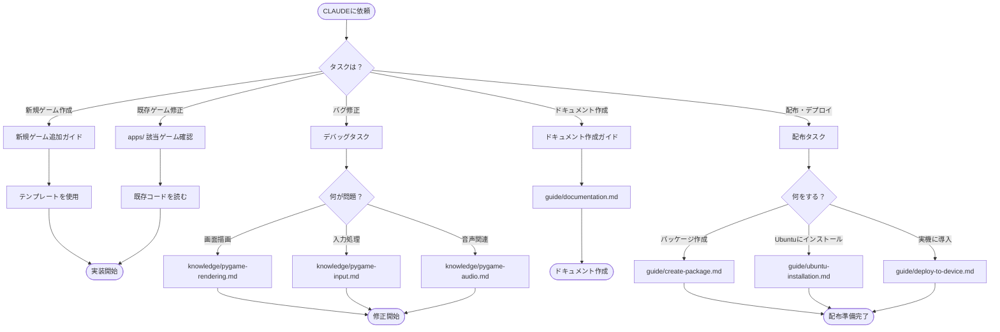

# CLAUDE.md - Baby Fun Box Project Guidelines

## 🗣 Language Preference

- 回答は **基本的に日本語** でお願いします。
- ただし、コード中のコメントや技術用語については英語のままで構いません。

---

## ⚡ TL;DR - 目的別クイックナビゲーション

目的に応じて以下のセクションへジャンプしてください：

| 目的                         | 参照セクション                                              | 所要時間 |
| ---------------------------- | ----------------------------------------------------------- | -------- |
| **新規ゲーム追加**           | [docs/guide/new-game.md](./docs/guide/new-game.md)          | 10 分    |
| **既存ゲーム修正**           | [apps/](./apps/) → 該当ゲームのディレクトリ                 | 5 分     |
| **配布パッケージ作成**       | [docs/guide/create-package.md](./docs/guide/create-package.md) | 5 分  |
| **Ubuntu インストール**      | [docs/guide/ubuntu-installation.md](./docs/guide/ubuntu-installation.md) | 5 分 |
| **実機への導入**             | [docs/guide/deploy-to-device.md](./docs/guide/deploy-to-device.md) | 10 分 |
| **Pygame 基礎学習**          | [docs/knowledge/](./docs/knowledge/)                        | 15 分    |
| **設計思想の理解**           | [docs/design/](./docs/design/)                              | 10 分    |
| **システム理解（新規参加）** | [docs/README.md](./docs/README.md)                          | 30 分    |

### 決定木



---

## 📂 プロジェクト構造

```
baby-fun-box/
├── CLAUDE.md              # このファイル（プロジェクトガイドライン）
├── apps/                  # Pygame ゲームアプリケーション
│   └── {game-name}/       # 各ゲームのディレクトリ
│       ├── main.py        # ゲームのエントリーポイント
│       ├── assets/        # 画像・音声リソース
│       └── README.md      # ゲーム固有のドキュメント
├── docs/                  # ドキュメント
│   ├── README.md          # ドキュメント全体のインデックス
│   ├── knowledge/         # 実践的知識（HOW）
│   ├── design/            # 設計思想（WHY）
│   ├── guide/             # ガイドライン
│   └── _templates/        # テンプレート
├── scripts/               # ビルド・配布スクリプト
│   ├── build.sh           # PyInstaller ビルドスクリプト
│   ├── install.sh         # Ubuntu インストーラー
│   └── baby-fun-box.desktop  # デスクトップエントリ
└── shared/                # 共有ライブラリ・ユーティリティ
```

---

## 📚 Knowledge Base

### ドキュメントの全体像

- **[docs/README.md](./docs/README.md)** - ドキュメント全体のインデックス

### カテゴリ別ガイド

| カテゴリ       | 内容                           | いつ見る                       |
| -------------- | ------------------------------ | ------------------------------ |
| `knowledge/`   | 実践的知識（HOW）              | 実装時の注意点が必要なとき     |
| `design/`      | 設計思想（WHY）                | 設計判断の背景を理解したいとき |
| `guide/`       | ガイドライン                   | 新規作成・貢献時               |
| `_templates/`  | テンプレートファイル           | 新しいドキュメント作成時       |

---

## 🎮 ゲーム開発ガイドライン

### 新しいゲームを追加する

1. `apps/` 配下に新しいディレクトリを作成
2. `main.py` をエントリーポイントとして作成
3. 必要に応じて `assets/` ディレクトリを作成
4. `README.md` でゲームの概要を記述

### コーディング規約

- **Python バージョン**: 3.10 以上
- **フォーマッター**: Black
- **型ヒント**: 必須（`mypy` でチェック）
- **docstring**: Google スタイル

### 実行方法

```bash
# 特定のゲームを実行
python apps/{game-name}/main.py

# 依存関係のインストール
pip install -r requirements.txt
```

---

## 🧪 テスト

```bash
# 全テスト実行
pytest

# 特定のゲームのテスト
pytest apps/{game-name}/tests/
```

---

## ✨ コードスタイル

### 推奨パターン

- ゲームループは `while running:` パターンを使用
- イベント処理は専用の関数に分離
- 描画処理は `draw()` メソッドにまとめる
- 状態管理はクラスで行う

### アンチパターン（避けるべき実装）

- グローバル変数の多用
- 巨大な単一ファイル（500 行以上）
- ハードコードされたマジックナンバー

---

## 📝 ドキュメント作成ガイド

新しいドキュメントを追加する際は、以下のガイドラインに従ってください：

- LLM/探索型ワークフロー最適化のためのガイドライン
- frontmatter の設定（title, category, tags, related）
- 相互リンクの追加
- Mermaid 図の活用

詳細は [docs/guide/documentation.md](./docs/guide/documentation.md) を参照。

---

## 🔁 Pull Request Format

### PR タイトル形式

```
{fix or feat}: {簡潔な説明}
```

**例**: `feat: 新しいバブルゲームを追加`

### 必須設定

- **Labels**: `fix` または `feature`
- **Base Branch**: `main`
