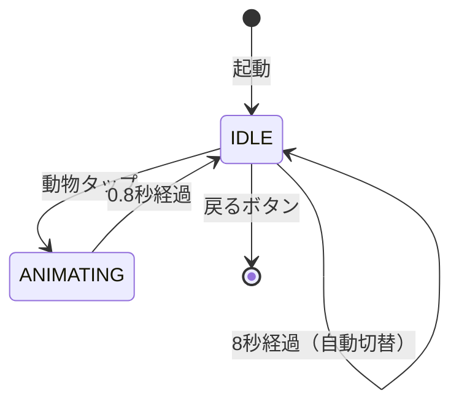

# Animal Touch - どうぶつタッチ

## 概要

画面に表示された動物をタップすると、鳴き声が聞こえてアニメーションする、1〜2歳児向けの教育的なゲームです。8種類の動物が登場し、それぞれの鳴き声を楽しく学べます。

## 対象年齢

**1〜2歳**

### この年齢に適している理由

- **大きなタッチターゲット**: 画面中央に大きく表示される動物
- **教育的要素**: 動物の名前と鳴き声を学べる
- **即座のフィードバック**: タップするとジャンプアニメーション + 鳴き声
- **シンプルな操作**: タップのみ
- **自動切り替え**: 8秒で次の動物に自動で切り替わる

## 登場する動物（8種類）

| 動物 | 鳴き声 | 色 |
|------|--------|-----|
| いぬ | ワンワン！ | 茶色 |
| ねこ | ニャー！ | オレンジ |
| うし | モー！ | 白黒 |
| ぶた | ブーブー！ | ピンク |
| ひつじ | メェー！ | 白 |
| にわとり | コケコッコー！ | 黄色/赤 |
| カエル | ケロケロ！ | 緑 |
| ライオン | ガオー！ | 黄金 |

## 遊び方

1. 画面中央に動物が表示されます
2. 動物をタップすると鳴き声が聞こえます
3. 矢印ボタンで前後の動物に切り替えられます
4. 8秒経つと自動的に次の動物に切り替わります

## 操作方法

| 操作 | アクション |
|------|----------|
| 動物をタップ | 鳴き声を聞く + アニメーション |
| 左矢印 / ← キー | 前の動物へ |
| 右矢印 / → キー | 次の動物へ |
| スペースキー | 鳴き声を聞く |
| 戻るボタン / ESC | ランチャーに戻る |

## 実行方法

### 統合アプリ経由

```bash
python main.py
# ランチャーでAnimal Touchを選択
```

### 単体実行（開発用）

```bash
python apps/animal_touch/main.py
```

## ファイル構成

```
animal_touch/
├── __init__.py      # モジュール初期化
├── main.py          # 単体実行用エントリーポイント
├── game.py          # AnimalTouchGame クラス（BaseGame継承）
├── README.md        # このファイル
└── assets/          # リソース
    ├── images/      # 動物画像（dog.png など）
    └── sounds/      # 鳴き声音声（dog.wav など）
```

## 技術的な詳細

### クラス構成

```
AnimalTouchGame (BaseGame)  - ゲーム全体の管理
├── Animal                  - 動物データ（名前、鳴き声、色、描画関数）
├── animal_images           - 画像キャッシュ
└── animal_sounds           - 音声キャッシュ
```

### 状態遷移



### 動物データ構造

```python
@dataclass
class Animal:
    name: str                    # 日本語名
    sound_text: str              # 鳴き声テキスト
    image_key: str               # 画像/音声ファイルのキー
    color: tuple[int, int, int]  # メインカラー
    secondary_color: tuple       # サブカラー
    draw_func: Callable          # フォールバック描画関数
    sound_freq: float            # 生成音声の周波数
```

### 特徴

- **BaseGame 継承**: ランチャーからの統一的な呼び出しに対応
- **プロシージャル描画**: 画像がなくても図形で動物を描画
- **プロシージャル効果音**: 周波数を変えて各動物の鳴き声を生成
- **バウンスアニメーション**: タップ時に動物がジャンプする
- **自動切り替え機能**: 8秒で次の動物に自動遷移
- **カスタムアセット対応**: `assets/` に画像/音声を配置すれば優先使用

### アニメーション計算

```python
# バウンスアニメーション（サイン波で減衰）
if self.is_animating:
    progress = self.animation_time / self.animation_duration
    bounce = math.sin(progress * math.pi * 3) * (1 - progress)
```

### タッチ領域

```python
# 動物のタッチ領域（画面中央の広い範囲）
animal_area = pygame.Rect(
    self.width // 4,
    self.height // 4,
    self.width // 2,
    self.height // 2,
)
```

## 今後の拡張案

- [ ] 動物の画像アセット追加
- [ ] 実際の動物の鳴き声音声ファイル
- [ ] 動物の数を増やす（海の生き物、鳥など）
- [ ] 動物クイズモード（「いぬ はどれ？」）
- [ ] 背景の変更（農場、動物園、森など）
- [ ] アイコン画像の追加

## 関連ドキュメント

- [Pygame 基礎](../../docs/knowledge/pygame-basics.md) - ゲームループ
- [Pygame 音声処理](../../docs/knowledge/pygame-audio.md) - プロシージャル音声生成
- [Pygame 描画処理](../../docs/knowledge/pygame-rendering.md) - プリミティブ描画
- [幼児向け UX 設計](../../docs/design/toddler-friendly.md) - フィードバック設計
- [Shared Library API](../../shared/README.md) - BackButton コンポーネント
