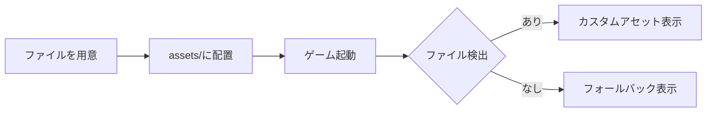
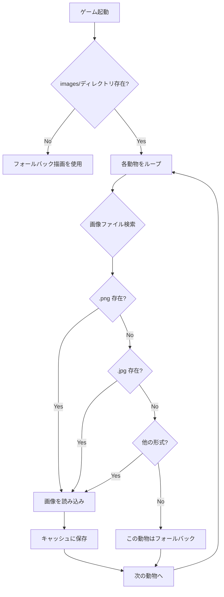
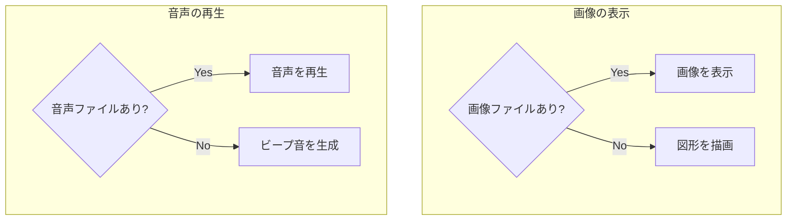

# アセットのカスタマイズ（画像・音声の入れ替え）

## 概要

「どうぶつタッチ」ゲームの動物画像と鳴き声音声をカスタマイズする方法を説明します。

画像・音声ファイルを所定のディレクトリに配置するだけで、プログラムの修正なしに差し替えが可能です。

## クイックスタート



**最短手順**:

1. 画像を `apps/animal_touch/assets/images/dog.png` に配置
2. 音声を `apps/animal_touch/assets/sounds/dog.ogg` に配置
3. `python main.py` で起動 → 反映される

---

## ディレクトリ構成

```
apps/animal_touch/
├── assets/
│   ├── images/          # 動物画像を配置
│   │   ├── dog.png
│   │   ├── cat.png
│   │   └── ...
│   └── sounds/          # 鳴き声音声を配置
│       ├── dog.ogg
│       ├── cat.ogg
│       └── ...
├── docs/
│   └── guide/
│       └── customize-assets.md  # このファイル
└── game.py              # ゲーム本体
```

---

## 画像ファイルの入れ替え

### 対応する動物キー

| ファイル名 | 動物 | 日本語表示 |
|-----------|------|-----------|
| `dog` | 犬 | いぬ |
| `cat` | 猫 | ねこ |
| `cow` | 牛 | うし |
| `pig` | 豚 | ぶた |
| `sheep` | 羊 | ひつじ |
| `chicken` | 鶏 | にわとり |
| `frog` | カエル | カエル |
| `lion` | ライオン | ライオン |

### 画像の要件

| 項目 | 要件 | 備考 |
|------|------|------|
| **フォーマット** | PNG（推奨）, JPG, JPEG, GIF, BMP | PNG は透過対応 |
| **アスペクト比** | 1:1（正方形）推奨 | 他の比率も自動調整される |
| **最小サイズ** | 400 x 400 px | これ以下は粗く表示される |
| **推奨サイズ** | 512 x 512 px | 最適なバランス |
| **最大サイズ** | 1024 x 1024 px | これ以上は読み込みが遅くなる |

### ファイル配置例

```bash
# PNG形式の場合
apps/animal_touch/assets/images/dog.png

# JPG形式の場合
apps/animal_touch/assets/images/cat.jpg

# 複数フォーマットが存在する場合は優先順位で選択
# .png > .jpg > .jpeg > .gif > .bmp
```

### 画像読み込みの仕組み



### ベストプラクティス

**推奨**:

- 透過PNG形式を使用（背景が透明になり自然に見える）
- 正方形の画像を用意（歪みなく表示される）
- 輪郭がはっきりしたシンプルなイラスト

**アンチパターン**:

- 極端に小さい画像（100x100 など）→ 拡大時にぼやける
- 極端に大きい画像（4000x4000 など）→ 起動が遅くなる
- 縦長・横長すぎる画像 → 表示領域に収まりきらない

---

## 音声ファイルの入れ替え

### 音声の要件

| 項目 | 要件 | 備考 |
|------|------|------|
| **フォーマット** | OGG（推奨）, WAV, MP3 | OGG は圧縮率と品質のバランスが良い |
| **長さ** | 1〜3 秒 | 短すぎると聞き取りにくい、長すぎると飽きる |
| **音量** | 適度に正規化 | ゲーム側で 50% に設定される |

### ファイル配置例

```bash
# OGG形式（推奨）
apps/animal_touch/assets/sounds/dog.ogg

# WAV形式
apps/animal_touch/assets/sounds/cat.wav

# MP3形式
apps/animal_touch/assets/sounds/lion.mp3
```

### 音声読み込みの仕組み

```python
# game.py の _find_sound_file メソッド
def _find_sound_file(self, sound_key: str) -> Path | None:
    """音声ファイルを探す"""
    for ext in [".ogg", ".wav", ".mp3"]:
        path = SOUNDS_DIR / f"{sound_key}{ext}"
        if path.exists():
            return path
    return None
```

**優先順位**: `.ogg` > `.wav` > `.mp3`

### ベストプラクティス

**推奨**:

- OGG形式を使用（ファイルサイズが小さく、品質が良い）
- 鳴き声の開始位置を揃える（無音部分を削除）
- 音量を統一する（各動物で音量差が大きいと違和感）

**アンチパターン**:

- 長すぎる音声（10秒以上）→ ユーザーが次の操作を待てない
- 冒頭に無音が長い → 反応が遅く感じる
- 音量が極端に大きい/小さい → 他の動物とバランスが悪い

---

## フォールバック動作

ファイルが存在しない場合、以下のフォールバックが自動的に使用されます：

| アセット | フォールバック |
|---------|--------------|
| 画像 | プログラムで描画された図形（pygame.draw）|
| 音声 | 周波数ベースで生成されたビープ音 |



**部分的なカスタマイズも可能**:

- 犬だけ画像を差し替えて、他はフォールバックを使う
- 画像は全てカスタム、音声はフォールバックのまま

---

## トラブルシューティング

### 問題1: 画像が表示されない

**原因**: ファイル名またはパスが間違っている

**確認手順**:

```bash
# ファイルが正しい場所にあるか確認
ls -la apps/animal_touch/assets/images/

# ファイル名が正しいか確認（大文字小文字に注意）
# OK: dog.png
# NG: Dog.png, DOG.png
```

**解決策**: ファイル名を小文字に統一し、正しいディレクトリに配置

---

### 問題2: 画像が粗く表示される

**原因**: 元画像のサイズが小さすぎる

**確認手順**:

```bash
# 画像サイズを確認（ImageMagick がインストールされている場合）
identify apps/animal_touch/assets/images/dog.png
```

**解決策**: 400x400px 以上の画像を用意する

---

### 問題3: 音声が再生されない

**原因**: pygame.mixer が初期化されていない、またはファイル形式が非対応

**確認手順**:

```python
# Python で直接テスト
import pygame
pygame.mixer.init()
sound = pygame.mixer.Sound("apps/animal_touch/assets/sounds/dog.ogg")
sound.play()
```

**解決策**:

- OGG または WAV 形式に変換
- ファイルが破損していないか確認

---

### 問題4: ゲーム起動が遅い

**原因**: 画像ファイルサイズが大きすぎる

**解決策**:

- 画像を 512x512px 程度にリサイズ
- PNG の圧縮率を上げる

---

## チェックリスト

### 画像の追加

- [ ] ファイル名が正しい（`dog.png` など小文字）
- [ ] `assets/images/` ディレクトリに配置
- [ ] サイズが 400x400px 以上、1024x1024px 以下
- [ ] 対応フォーマット（PNG/JPG/GIF/BMP）

### 音声の追加

- [ ] ファイル名が正しい（`dog.ogg` など小文字）
- [ ] `assets/sounds/` ディレクトリに配置
- [ ] 長さが 1〜3 秒程度
- [ ] 対応フォーマット（OGG/WAV/MP3）

### 動作確認

- [ ] `python main.py` でゲーム起動
- [ ] カスタム画像が表示される
- [ ] カスタム音声が再生される

---

## 関連ドキュメント

- [新しいゲームの追加方法](../../../../docs/guide/new-game.md) - 新規ゲーム作成時の参考
- [Pygame 音声処理](../../../../docs/knowledge/pygame-audio.md) - 音声関連の詳細
- [GitHub Issue #1](https://github.com/kenimo49/baby-fun-box/issues/1) - アセット準備のタスク

---

## フリー素材の入手先

### 画像素材

| サイト | 特徴 |
|--------|------|
| [いらすとや](https://www.irasutoya.com/) | 日本語、商用利用可、クレジット不要 |
| [イラストAC](https://www.ac-illust.com/) | 日本語、要会員登録 |
| [Freepik](https://www.freepik.com/) | 英語、要クレジット |

### 音声素材

| サイト | 特徴 |
|--------|------|
| [効果音ラボ](https://soundeffect-lab.info/) | 日本語、商用利用可 |
| [DOVA-SYNDROME](https://dova-s.jp/) | 日本語、商用利用可 |
| [Freesound](https://freesound.org/) | 英語、ライセンス確認必要 |
