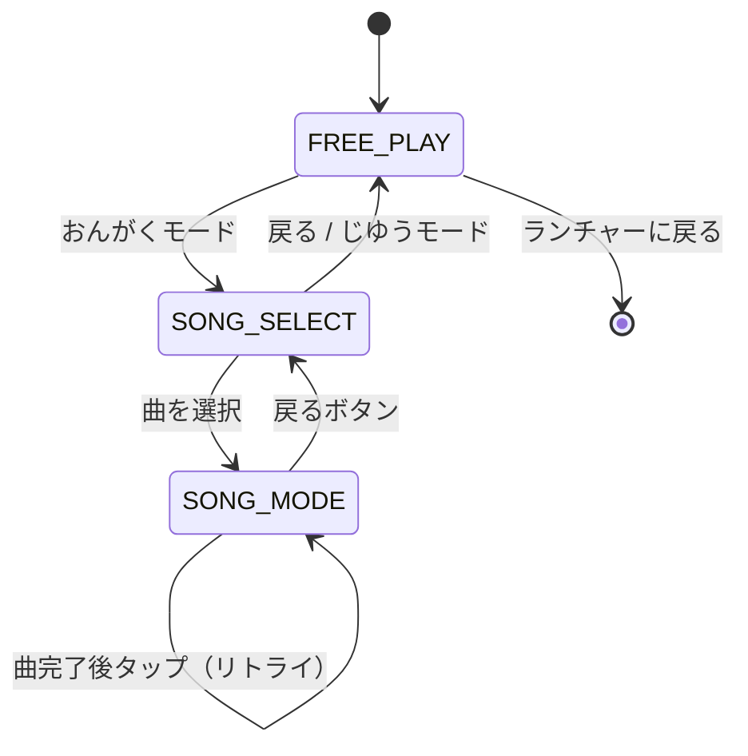

# Baby Piano - ベビーピアノ

## 概要

カラフルな虹色の鍵盤をタップして音を鳴らす、1〜2歳児向けのピアノゲームです。フリープレイモードと、曲に合わせて鍵盤を弾く「おんがくモード」の2つのモードを搭載しています。

## 対象年齢

**1〜2歳**

### この年齢に適している理由

- **大きな鍵盤**: 画面幅いっぱいの8鍵（ド〜ド）で押しやすい
- **虹色のデザイン**: 各鍵盤が異なる鮮やかな色で視覚的に楽しい
- **即座のフィードバック**: 押した瞬間に音 + 視覚的な押し込みアニメーション
- **音ゲーモード**: 光る鍵盤を追いかけて、曲を演奏する達成感
- **ポジティブな体験**: 間違えても叱られない設計

## 遊び方

### フリープレイモード

1. 虹色の鍵盤を自由にタップ
2. 押した鍵盤の音（ド〜高いド）が鳴る
3. 画面上部に押した音の名前が表示される

### おんがくモード

1. 右上の「おんがくモード」ボタンをタップ
2. 曲を選択（きらきら星、かえるのうた など）
3. 光っている鍵盤（★マーク付き）をタップ
4. 曲が進み、進捗バーが更新される
5. 曲が完了すると「できたね！」と表示

## 操作方法

| 操作 | アクション |
|------|----------|
| 鍵盤タップ | 音を鳴らす |
| 数字キー 1〜8 | 各鍵盤を押す（キーボード操作） |
| 「おんがくモード」ボタン | モード切替 |
| 戻るボタン（左上） | 前画面 / ランチャーに戻る |
| ESC キー | ランチャーに戻る |

## 収録曲

| 曲名 | テンポ | 特徴 |
|------|--------|------|
| きらきら星 | ゆっくり | 初心者向け、繰り返しが多い |
| かえるのうた | やや速い | リズミカル |
| ちょうちょう | 普通 | メロディアス |
| メリーさんのひつじ | 普通 | 親しみやすい |

## 実行方法

### 統合アプリ経由

```bash
# プロジェクトルートから
python main.py
# ランチャーでBaby Pianoを選択
```

### 単体実行（開発用）

```bash
# プロジェクトルートから
python apps/baby_piano/main.py
```

## ファイル構成

```
baby_piano/
├── __init__.py      # モジュール初期化
├── main.py          # 単体実行用エントリーポイント
├── game.py          # BabyPianoGame クラス（BaseGame継承）
├── README.md        # このファイル
└── assets/          # リソース
    ├── images/
    └── sounds/      # 音声ファイル（c4.wav など）
```

## 技術的な詳細

### クラス構成

```
BabyPianoGame (BaseGame)   - ゲーム全体の管理
├── PianoKey               - 鍵盤データ（位置、色、周波数）
├── Song                   - 曲データ（タイトル、ノート配列、テンポ）
└── GameMode (Enum)        - FREE_PLAY / SONG_MODE / SONG_SELECT
```

### 状態遷移図



### 特徴

- **BaseGame 継承**: ランチャーからの統一的な呼び出しに対応
- **プロシージャル音声生成**: 外部ファイルなしで8音階を生成
- **ADSR エンベロープ**: 自然なピアノ音を実現
- **ハイライトアニメーション**: 音ゲーモードで次の鍵盤がパルスで光る
- **カスタム音声対応**: `assets/sounds/` に配置すれば優先使用

### 音階データ

```python
NOTES = [
    {"name": "ド", "freq": 261.63, "key": "c4"},
    {"name": "レ", "freq": 293.66, "key": "d4"},
    {"name": "ミ", "freq": 329.63, "key": "e4"},
    {"name": "ファ", "freq": 349.23, "key": "f4"},
    {"name": "ソ", "freq": 392.00, "key": "g4"},
    {"name": "ラ", "freq": 440.00, "key": "a4"},
    {"name": "シ", "freq": 493.88, "key": "b4"},
    {"name": "ド", "freq": 523.25, "key": "c5"},
]
```

## 今後の拡張案

- [ ] タッチスクリーン対応の最適化
- [ ] 曲の追加（童謡、季節の歌など）
- [ ] 録音・再生機能
- [ ] 黒鍵の追加（半音対応）
- [ ] 楽器音色の切り替え（ピアノ、ベル、オルガンなど）
- [ ] アイコン画像の追加

## 関連ドキュメント

- [Pygame 基礎](../../docs/knowledge/pygame-basics.md) - ゲームループ
- [Pygame 音声処理](../../docs/knowledge/pygame-audio.md) - プロシージャル音声生成
- [幼児向け UX 設計](../../docs/design/toddler-friendly.md) - フィードバック設計
- [状態管理設計](../../docs/design/state-management.md) - GameMode の設計
