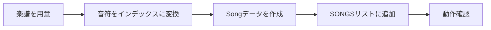

# 曲の追加方法

## 概要

ベビーピアノの「おんがくモード」に新しい曲を追加する方法を説明します。

## クイックスタート



---

## 音階とインデックスの対応

ベビーピアノは1オクターブ（8鍵盤）です。各音階にインデックスが割り当てられています。

| インデックス | 音階 | 音名 | 色 |
|-------------|------|------|-----|
| 0 | ド | C4 | 赤 |
| 1 | レ | D4 | オレンジ |
| 2 | ミ | E4 | 黄 |
| 3 | ファ | F4 | 緑 |
| 4 | ソ | G4 | 水色 |
| 5 | ラ | A4 | 青 |
| 6 | シ | B4 | 紫 |
| 7 | ド（高） | C5 | ピンク |
| -1 | 休符 | - | - |

---

## Song データ構造

```python
@dataclass
class Song:
    """曲のデータ"""
    title: str           # 曲名（日本語OK）
    notes: list[int]     # 音符のインデックスリスト
    tempo: float = 0.6   # 各音の間隔（秒）※現在未使用
```

---

## 曲の追加手順

### 1. 楽譜を音符インデックスに変換

例: 「きらきら星」の冒頭

```
楽譜:   ド ド ソ ソ ラ ラ ソ （休）
         ↓
インデックス: 0, 0, 4, 4, 5, 5, 4, -1
```

### 2. game.py の SONGS リストに追加

```python
# game.py の SONGS リストを探す
SONGS = [
    Song(
        title="きらきら星",
        notes=[...],
        tempo=0.5,
    ),
    # ここに新しい曲を追加
    Song(
        title="新しい曲",
        notes=[
            0, 0, 4, 4, 5, 5, 4, -1,  # 1行目
            3, 3, 2, 2, 1, 1, 0, -1,  # 2行目
            # ...
        ],
        tempo=0.5,
    ),
]
```

### 3. 動作確認

```bash
python main.py
# または
python apps/baby_piano/main.py
```

---

## 実装例

### 例1: 「ぶんぶんぶん」を追加

```
楽譜: ソソミ（休）ソソミ（休）レレミミファファファファソ（休）
```

```python
Song(
    title="ぶんぶんぶん",
    notes=[
        4, 4, 2, -1,              # ソソミ（休）
        4, 4, 2, -1,              # ソソミ（休）
        1, 1, 2, 2, 3, 3, 3, 3,   # レレミミファファファファ
        4, -1,                     # ソ（休）
    ],
    tempo=0.4,
),
```

### 例2: 「むすんでひらいて」を追加

```
楽譜: ドドドレミミレ ミミファソ（休）
```

```python
Song(
    title="むすんでひらいて",
    notes=[
        0, 0, 0, 1, 2, 2, 1, -1,  # ドドドレミミレ
        2, 2, 3, 4, -1,           # ミミファソ
        # ...続き
    ],
    tempo=0.45,
),
```

---

## 楽譜の変換のコツ

### 休符の入れ方

- フレーズの区切りに `-1` を入れる
- 入れすぎると間延びするので注意

```python
# 良い例: フレーズごとに休符
[0, 0, 4, 4, 5, 5, 4, -1, 3, 3, 2, 2, 1, 1, 0]

# 悪い例: 休符が多すぎ
[0, -1, 0, -1, 4, -1, 4, -1, 5, -1, 5, -1, 4, -1]
```

### オクターブの調整

1オクターブしかないため、高すぎる/低すぎる音は調整が必要です。

```python
# 元の楽譜がラシド（高）の場合
# A4, B4, C5 → インデックス 5, 6, 7

# 元の楽譜がシドレ（低）の場合
# 1オクターブ上げて変換: B3, C4, D4 → 6, 0, 1（または移調）
```

---

## ベストプラクティス

### 推奨

- 曲名は日本語で分かりやすく
- 1曲あたり30〜60音程度が適切
- フレーズごとにコメントを付ける
- 休符でリズム感を出す

### アンチパターン

- 曲が長すぎる（100音以上）→ 子供が飽きる
- 休符がない → リズム感がなくなる
- 同じ音が続きすぎる → 単調になる

---

## チェックリスト

- [ ] 音符インデックスが 0〜7 または -1 の範囲内
- [ ] 曲名が設定されている
- [ ] 休符でフレーズが区切られている
- [ ] 曲の長さが適切（30〜60音程度）
- [ ] `python main.py` で動作確認

---

## トラブルシューティング

### 問題1: 曲が表示されない

**原因**: SONGS リストへの追加が正しくない

**解決策**:
```python
# カンマの確認
SONGS = [
    Song(...),  # ← カンマ忘れ注意
    Song(...),
]
```

### 問題2: インデックスエラー

**原因**: 音符インデックスが範囲外

**解決策**:
- 0〜7 または -1 のみを使用
- 8以上の値は使用不可

### 問題3: 曲がすぐ終わる

**原因**: 音符リストが短すぎる、または休符が多すぎる

**解決策**:
- 音符を追加する
- 不要な休符を削除する

---

## 関連ドキュメント

- [遊び方ガイド](./how-to-play.md)
- [音声のカスタマイズ](./customize-sounds.md)
- [ベビーピアノ ドキュメント トップ](../README.md)
