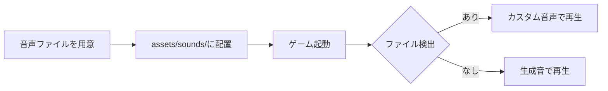
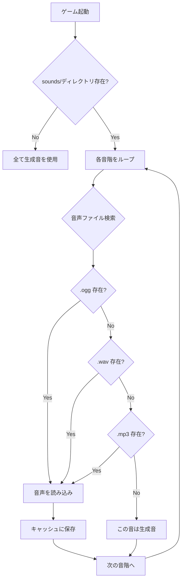

# 音声のカスタマイズ

## 概要

ベビーピアノの鍵盤音をカスタム音声ファイルに差し替える方法を説明します。

デフォルトではプログラムで生成した音（サイン波ベース）を使用していますが、ピアノやオルガンなどのリアルな音声に差し替えることができます。

## クイックスタート



**最短手順**:

1. `c4.ogg` を `apps/baby_piano/assets/sounds/` に配置
2. ゲーム起動 → 「ド」の音がカスタム音声に

---

## ディレクトリ構成

```
apps/baby_piano/
├── assets/
│   └── sounds/           # 音声ファイルを配置
│       ├── c4.ogg        # ド
│       ├── d4.ogg        # レ
│       ├── e4.ogg        # ミ
│       ├── f4.ogg        # ファ
│       ├── g4.ogg        # ソ
│       ├── a4.ogg        # ラ
│       ├── b4.ogg        # シ
│       └── c5.ogg        # ド（高）
└── game.py
```

---

## ファイル名と音階の対応

| ファイル名 | 音階 | 周波数 |
|-----------|------|--------|
| `c4` | ド | 261.63 Hz |
| `d4` | レ | 293.66 Hz |
| `e4` | ミ | 329.63 Hz |
| `f4` | ファ | 349.23 Hz |
| `g4` | ソ | 392.00 Hz |
| `a4` | ラ | 440.00 Hz |
| `b4` | シ | 493.88 Hz |
| `c5` | ド（高） | 523.25 Hz |

---

## 音声ファイルの要件

| 項目 | 要件 | 備考 |
|------|------|------|
| **フォーマット** | OGG（推奨）, WAV, MP3 | OGG は圧縮率と品質のバランスが良い |
| **長さ** | 0.5〜1秒程度 | 短すぎると途切れ、長すぎると重なる |
| **音量** | 適度に正規化 | ゲーム側で 60% に設定される |
| **サンプルレート** | 22050 Hz 以上 | 推奨: 44100 Hz |

---

## 音声読み込みの仕組み



**優先順位**: `.ogg` > `.wav` > `.mp3`

---

## ベストプラクティス

### 推奨

- **OGG形式を使用** - ファイルサイズが小さく品質が良い
- **音の開始位置を揃える** - 無音部分を削除
- **音量を統一** - 全ての音で同じ音量レベル
- **サステイン（余韻）を適度に** - 0.5秒程度の自然な減衰

### アンチパターン

- **長すぎる音声**（2秒以上）→ 次の音と重なる
- **冒頭に無音**がある → 反応が遅く感じる
- **音量がバラバラ** → 弾いていて違和感
- **ノイズが多い** → 耳障り

---

## 音声素材の入手先

### フリー素材サイト

| サイト | 特徴 |
|--------|------|
| [Freesound](https://freesound.org/) | 英語、ピアノ音多数、ライセンス確認必要 |
| [DOVA-SYNDROME](https://dova-s.jp/) | 日本語、楽器音あり、商用利用可 |

### 自分で録音

1. ピアノやキーボードで各音を録音
2. 音声編集ソフト（Audacity等）で編集
3. OGG形式で書き出し

---

## フォールバック動作

ファイルが存在しない場合、プログラムで音を生成します：

```python
# 生成される音の特徴
- 基音（サイン波）
- 2倍音（30%）
- 3倍音（10%）
- ADSRエンベロープ
```

**部分的なカスタマイズも可能**:
- 「ド」だけカスタム音声、他は生成音
- 低音はカスタム、高音は生成音

---

## トラブルシューティング

### 問題1: 音声が再生されない

**原因**: ファイル名またはパスが間違っている

**確認手順**:
```bash
ls -la apps/baby_piano/assets/sounds/
# ファイル名が正しいか確認（小文字）
# OK: c4.ogg
# NG: C4.ogg, do.ogg
```

**解決策**: ファイル名を `c4`, `d4` ... の形式に統一

---

### 問題2: 音質が悪い

**原因**: サンプルレートが低い、または圧縮しすぎ

**解決策**:
- サンプルレート 44100 Hz で再エクスポート
- OGG の品質設定を上げる（推奨: 6以上）

---

### 問題3: 音のタイミングがずれる

**原因**: 音声ファイルの冒頭に無音がある

**解決策**:
- Audacity等で無音部分をカット
- 波形の開始位置を確認

---

### 問題4: 音が途中で切れる

**原因**: 音声ファイルが短すぎる

**解決策**:
- 0.5秒以上の長さにする
- リバーブやリリースを追加

---

## チェックリスト

### 音声ファイルの準備

- [ ] ファイル名が正しい（`c4.ogg`, `d4.ogg` など小文字）
- [ ] `assets/sounds/` ディレクトリに配置
- [ ] 長さが 0.5〜1秒程度
- [ ] 対応フォーマット（OGG/WAV/MP3）
- [ ] 冒頭の無音を削除済み
- [ ] 音量が統一されている

### 動作確認

- [ ] `python main.py` でゲーム起動
- [ ] カスタム音声が再生される
- [ ] 全ての音階で音が鳴る

---

## 関連ドキュメント

- [遊び方ガイド](./how-to-play.md)
- [曲の追加方法](./add-songs.md)
- [Pygame 音声処理](../../../../docs/knowledge/pygame-audio.md)
- [ベビーピアノ ドキュメント トップ](../README.md)
