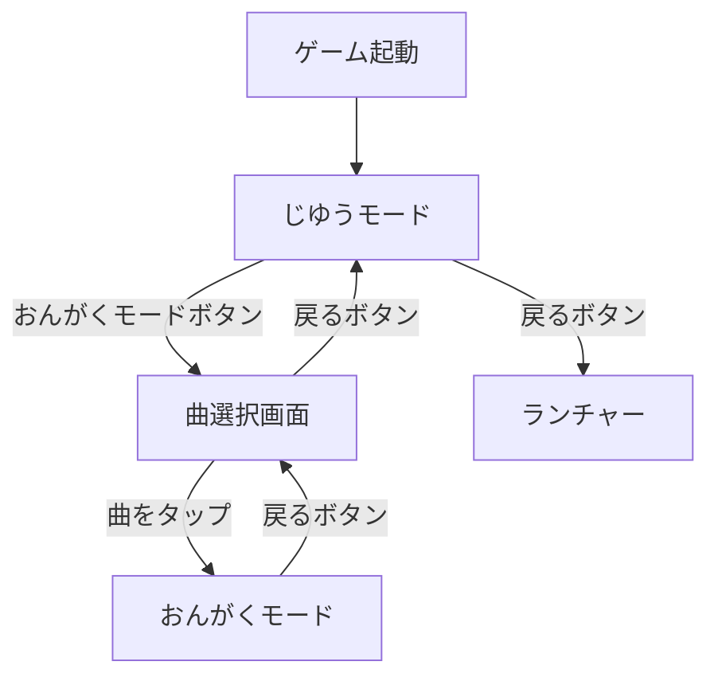
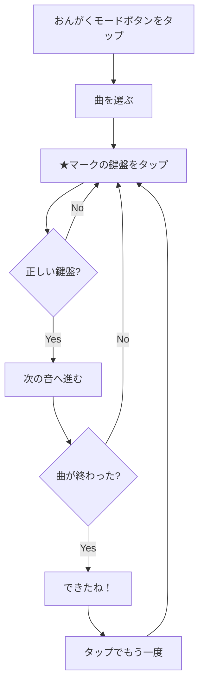

# ベビーピアノの遊び方

## 概要

ベビーピアノは、1〜2歳児向けのカラフルなピアノゲームです。2つのモードで楽しめます。

## モード一覧

---

## じゆうモード

自由に鍵盤をタップして音を鳴らすモードです。

### 操作方法

| 操作 | 動作 |
|------|------|
| 鍵盤をタップ | 音が鳴る |
| 「おんがくモード」ボタン | 曲選択画面へ |
| 戻るボタン（家アイコン） | ランチャーに戻る |

### 鍵盤の配置

左から右へ、1オクターブの音階が並んでいます：

| 色 | 音階 | 周波数 |
|----|------|--------|
| 赤 | ド (C4) | 261.63 Hz |
| オレンジ | レ (D4) | 293.66 Hz |
| 黄 | ミ (E4) | 329.63 Hz |
| 緑 | ファ (F4) | 349.23 Hz |
| 水色 | ソ (G4) | 392.00 Hz |
| 青 | ラ (A4) | 440.00 Hz |
| 紫 | シ (B4) | 493.88 Hz |
| ピンク | ド (C5) | 523.25 Hz |

### キーボード操作（開発用）

| キー | 音階 |
|------|------|
| 1 | ド |
| 2 | レ |
| 3 | ミ |
| 4 | ファ |
| 5 | ソ |
| 6 | ラ |
| 7 | シ |
| 8 | ド（高） |

---

## おんがくモード

曲に合わせて順番に鍵盤を弾くモードです。

### 遊び方の流れ

### 収録曲

| 曲名 | 難易度 | 音数 |
|------|--------|------|
| きらきら星 | ★☆☆ | 48 |
| かえるのうた | ★☆☆ | 32 |
| ちょうちょう | ★★☆ | 32 |
| メリーさんのひつじ | ★★☆ | 29 |

### 視覚的フィードバック

| 表示 | 意味 |
|------|------|
| ★マーク | 次に押すべき鍵盤 |
| 黄色の光る枠 | ハイライト（パルスアニメーション） |
| 進捗バー | 曲の進行状況 |
| 「できたね！」 | 曲の完了 |

### 操作方法

| 操作 | 動作 |
|------|------|
| 光っている鍵盤をタップ | 次の音へ進む |
| 「じゆうモード」ボタン | フリープレイに戻る |
| 戻るボタン | 曲選択画面に戻る |
| 曲完了後にタップ | もう一度プレイ |

---

## トラブルシューティング

### 問題1: 音が鳴らない

**原因**: pygame.mixer が初期化されていない

**解決策**:
- ゲームを再起動する
- 他のアプリで音声が再生できるか確認する

### 問題2: 鍵盤が反応しない

**原因**: タップ位置が鍵盤外

**解決策**:
- 鍵盤の中央をタップする
- タッチパネルのキャリブレーションを確認する

### 問題3: おんがくモードで進まない

**原因**: 正しい鍵盤をタップしていない

**解決策**:
- ★マークが付いている鍵盤をタップする
- 黄色く光っている鍵盤を確認する

---

## 関連ドキュメント

- [曲の追加方法](./add-songs.md)
- [音声のカスタマイズ](./customize-sounds.md)
- [ベビーピアノ ドキュメント トップ](../README.md)
