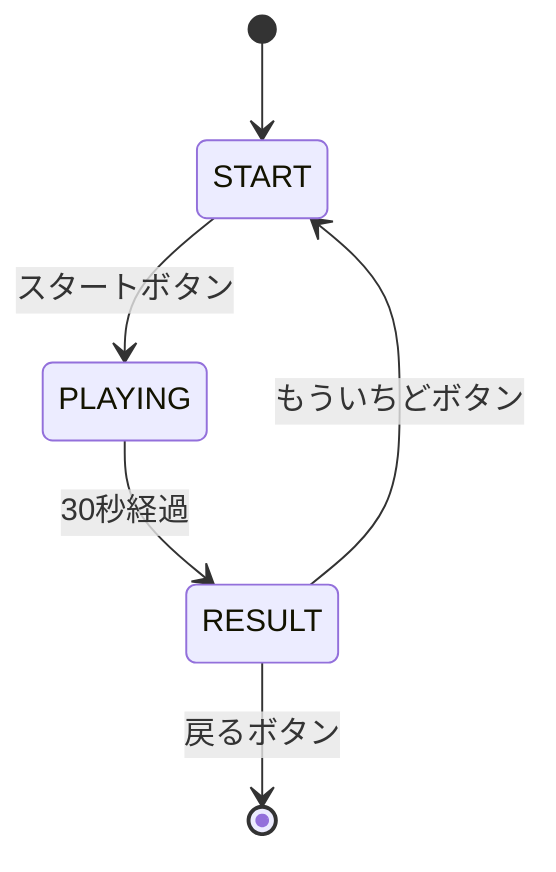

# Mogura Tataki - もぐらたたき

## 概要

穴から顔を出すかわいい動物をタップする、1〜2歳児向けのもぐらたたきゲームです。30秒間でどれだけ多くの動物をタッチできるかチャレンジします。

## 対象年齢

**1〜2歳**

### この年齢に適している理由

- **大きなタッチターゲット**: 動物は顔のサイズ 100px で押しやすい
- **かわいいキャラクター**: うさぎ、くま、ねこ、いぬ、ひよこ、かえるの6種類
- **即座のフィードバック**: タップ時に跳ねるアニメーション + 効果音 + パーティクル
- **短いゲームサイクル**: 30秒で完結、集中力が続く
- **すべてポジティブ**: 0点でも「たのしかったね！」と表示

## 遊び方

1. スタート画面で「ゲームスタート！」をタップ
2. 穴から顔を出した動物をタップ
3. タップするとスコアが1点加算
4. 30秒経過すると結果画面へ
5. 「もういちど」で再チャレンジ

## 操作方法

| 操作 | アクション |
|------|----------|
| 動物をタップ | スコア獲得 |
| スタートボタン | ゲーム開始 |
| もういちどボタン | リトライ |
| 戻るボタン（左上） | ランチャーに戻る |
| ESC キー | ランチャーに戻る |

## スコア基準

| スコア | 褒め言葉 |
|--------|----------|
| 15点以上 | すごーい！ |
| 10〜14点 | がんばったね！ |
| 5〜9点 | いいね！ |
| 0〜4点 | たのしかったね！ |

## 実行方法

### 統合アプリ経由

```bash
# プロジェクトルートから
python main.py
# ランチャーでMoguraを選択
```

### 単体実行（開発用）

```bash
# プロジェクトルートから
python apps/mogura_tataki/main.py
```

## ファイル構成

```
mogura_tataki/
├── __init__.py      # モジュール初期化
├── main.py          # 単体実行用エントリーポイント
├── game.py          # MoguraTatakiGame クラス（BaseGame継承）
├── README.md        # このファイル
└── assets/          # リソース
    ├── images/      # キャラクター画像（rabbit.png など）
    └── sounds/      # 効果音（pop.wav, tap.wav など）
```

## 技術的な詳細

### クラス構成

```
MoguraTatakiGame (BaseGame)  - ゲーム全体の管理
├── Hole                     - 穴データ（位置、出現状態、アニメーション）
├── Character                - キャラクターデータ（名前、色、画像キー）
└── GameState (Enum)         - START / PLAYING / RESULT
```

### 状態遷移図



### キャラクター

| キャラクター | 色 | 画像キー |
|-------------|-----|---------|
| うさぎ | ピンク | rabbit |
| くま | オレンジ | bear |
| ねこ | 黄色 | cat |
| いぬ | 青 | dog |
| ひよこ | 黄色 | chick |
| かえる | 緑 | frog |

### ゲーム設定

```python
GRID_COLS = 3          # 横3列
GRID_ROWS = 2          # 縦2行（計6穴）
HOLE_SIZE = 140        # 穴のサイズ
MIN_SHOW_TIME = 2.0    # 最小表示時間
MAX_SHOW_TIME = 4.0    # 最大表示時間
SPAWN_INTERVAL = 1.5   # 出現間隔
GAME_TIME = 30.0       # ゲーム時間（秒）
```

### 特徴

- **BaseGame 継承**: ランチャーからの統一的な呼び出しに対応
- **プロシージャル効果音**: ポップ音、タップ音、終了ファンファーレを生成
- **出現アニメーション**: 穴から徐々に顔を出す滑らかな動き
- **タップアニメーション**: ヒット時に跳ねる演出
- **パーティクルエフェクト**: タップ成功時にカラフルな粒子が飛び散る
- **カスタムアセット対応**: `assets/` に配置すれば優先使用

### 当たり判定

```python
# 顔の領域で判定（穴の上部）
face_rect = pygame.Rect(
    hole.x - 50,
    hole.y - 80,
    100,
    100
)
if face_rect.collidepoint(x, y) and hole.pop_progress > 0.5:
    # ヒット処理
```

## 今後の拡張案

- [ ] タッチスクリーン対応の最適化
- [ ] 難易度設定（出現速度、表示時間）
- [ ] キャラクター追加
- [ ] コンボシステム（連続タップでボーナス）
- [ ] BGM の追加
- [ ] アイコン画像の追加

## 関連ドキュメント

- [Pygame 基礎](../../docs/knowledge/pygame-basics.md) - ゲームループ
- [幼児向け UX 設計](../../docs/design/toddler-friendly.md) - ポジティブ評価設計
- [状態管理設計](../../docs/design/state-management.md) - GameState パターン
- [Shared Library API](../../shared/README.md) - BackButton コンポーネント
