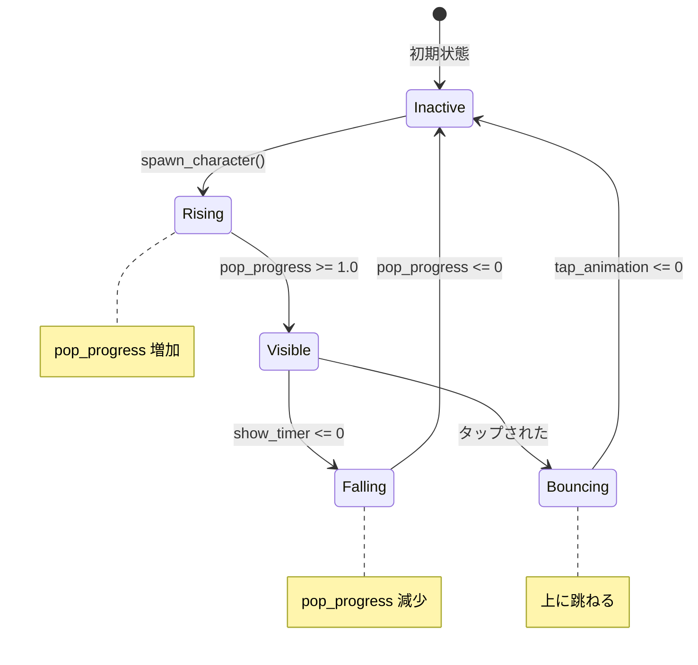

# アニメーションシステム

## 概要

もぐらたたきのアニメーションシステムは、キャラクターの出現・引っ込み・タップ時の反応を管理します。

## 穴のデータ構造

```python
@dataclass
class Hole:
    x: int                    # 中心X座標
    y: int                    # 中心Y座標
    rect: pygame.Rect         # クリック判定領域
    is_active: bool           # キャラクターが出ているか
    character_index: int      # どのキャラクター
    pop_progress: float       # 出現アニメーション (0.0-1.0)
    show_timer: float         # 表示残り時間
    was_tapped: bool          # タップされたか
    tap_animation: float      # タップアニメーション
```

## 状態遷移



## 出現アニメーション

### 上昇フェーズ

```python
# 出現速度
POP_SPEED = 3.0

# 毎フレーム更新
if hole.pop_progress < 1.0:
    hole.pop_progress += POP_SPEED * dt
    hole.pop_progress = min(hole.pop_progress, 1.0)
```

### 描画時のクリップ

`pop_progress` に応じて表示する高さを制限：

```python
visible_height = int(size * min(progress, 1.0))

# キャラクター画像をクリップ
clip_rect = pygame.Rect(0, size - visible_height, size, visible_height)
clipped = image.subsurface(clip_rect)
```

## タップアニメーション

### バウンス効果

タップされると上に跳ねる：

```python
if hole.was_tapped and hole.tap_animation > 0:
    bounce = math.sin(hole.tap_animation * math.pi) * 30
    char_y -= bounce
```

### パーティクル

タップ時にカラフルなパーティクルを生成：

```python
def _spawn_particles(self, x, y, color):
    for _ in range(8):
        angle = random.uniform(0, math.pi * 2)
        speed = random.uniform(100, 200)
        particles.append({
            "x": x, "y": y,
            "vx": math.cos(angle) * speed,
            "vy": math.sin(angle) * speed,
            "life": 0.5,
            "color": color,
        })
```

## 出現タイミング

### スポーンロジック

```python
SPAWN_INTERVAL = 1.5  # 秒

self.spawn_timer -= dt
if self.spawn_timer <= 0 and self.active_count < 3:
    self._spawn_character()
    self.spawn_timer = SPAWN_INTERVAL
```

### 表示時間

```python
MIN_SHOW_TIME = 2.0
MAX_SHOW_TIME = 4.0

hole.show_timer = random.uniform(MIN_SHOW_TIME, MAX_SHOW_TIME)
```

## パフォーマンス考慮

1. **最大同時表示数を制限** (3体まで)
2. **パーティクルの寿命管理**
3. **非アクティブな穴の更新をスキップ**

## トラブルシューティング

### アニメーションがカクつく

- `dt` が正しく渡されているか確認
- パーティクル数が多すぎないか確認

### キャラクターがすぐ消える

- `show_timer` の値を確認
- `MIN_SHOW_TIME` を増やす
