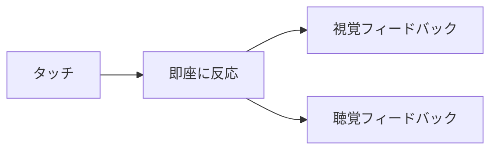

# 幼児UX設計

## 概要

おえかきらくがきは、1〜2歳児が直感的に遊べるよう設計されています。
このドキュメントでは、幼児向けUX設計の考え方を説明します。

## 設計原則

### 1. 即座のフィードバック



- **タッチ → 線が描かれる**: 遅延なし
- **ボタンタップ → 音が鳴る**: 操作の確認
- **色変更 → 枠線が変わる**: 選択状態の明示

### 2. 大きなタッチターゲット

| 要素 | 推奨サイズ | 理由 |
|------|-----------|------|
| 色ボタン | 50x50 px | 指でタップしやすい |
| サイズボタン | 50x50 px | 同上 |
| スタンプボタン | 50x50 px | 同上 |
| クリアボタン | 100x40 px | 誤操作を防ぐため少し小さめ |

幼児の指は小さいですが、精度が低いため大きなターゲットが必要です。

### 3. シンプルな操作

**基本操作は1つだけ**: 「なぞって描く」

追加機能（色変更、スタンプ等）は任意で、使わなくても遊べます。

```
必須操作:
  タッチして動かす → 線が描ける

任意操作:
  色ボタン → 色を変える
  サイズボタン → 太さを変える
  スタンプボタン → スタンプモードに
```

### 4. 誤操作への耐性

| 誤操作 | 対策 |
|--------|------|
| 意図しないクリア | 履歴は保持しない（シンプルに）、やり直しなし |
| 意図しないランチャー戻り | 確認なしで戻る（簡単に再開できる） |
| ツールバーへの誤タッチ | 描画領域と明確に分離 |

### 5. 視覚的な明確さ

```
選択状態の表示:
┌─────────┐
│  色ボタン │ ← 選択中は太い枠線
│ (選択中) │
└─────────┘

非選択状態:
┌─────────┐
│  色ボタン │ ← 細い枠線
│         │
└─────────┘
```

## 色の選定

### BABY_COLORS パレット

幼児の色認識に基づいて選定：

| 色 | 選定理由 |
|----|---------|
| 赤 | 最初に認識する色の一つ |
| 黄 | 明るく目立つ |
| 緑 | 自然界でよく見る |
| 青 | 空・水を連想 |
| 紫 | 色の多様性 |
| オレンジ | 暖かみのある色 |
| ピンク | 親しみやすい色 |

### 彩度と明度

- **高彩度**: 鮮やかで認識しやすい
- **中〜高明度**: 暗い色は避ける

## 音声フィードバック

### 音の特性

| 音 | 特性 | 理由 |
|----|------|------|
| ポップ音 | 短い、高め | 軽快で楽しい |
| キラキラ音 | 複数の高周波 | 特別感を演出 |

### 音量設計

- **小さめ（0.25〜0.3）**: 繰り返し聞いても疲れない
- **急な音量変化なし**: 驚かせない

## レイアウト設計

### 画面構成

```
┌────────────────────────────────────────┐
│ ヘッダー (70px)                         │ ← 最小限のUI
│ 戻るボタン + タイトル + クリア          │
├────────────────────────────────────────┤
│                                        │
│                                        │
│ キャンバス (最大化)                     │ ← メインの遊び場
│                                        │
│                                        │
├────────────────────────────────────────┤
│ ツールバー (110px)                      │ ← 追加機能
│ 色 + サイズ + スタンプ                  │
└────────────────────────────────────────┘
```

### 優先順位

1. **キャンバス**: 最大の面積を確保
2. **戻るボタン**: 常にアクセス可能
3. **ツール**: 下部に配置（誤操作を減らす）

## トレードオフ

### 機能 vs シンプルさ

| 機能 | 採用 | 理由 |
|------|------|------|
| アンドゥ | ❌ | 複雑になる |
| 保存 | ❌ | 必要性が低い |
| レイヤー | ❌ | 理解が難しい |
| スタンプ | ✅ | タップだけで楽しい |
| 色変更 | ✅ | 視覚的に分かりやすい |

### シンプルさを優先

- 機能を絞る
- 操作を減らす
- 視覚的な手がかりを増やす

## まとめ

幼児向けUX設計の要点：

1. **即座のフィードバック** - 遅延なく反応
2. **大きなターゲット** - 50px以上
3. **シンプルな操作** - 基本は「なぞる」だけ
4. **誤操作への耐性** - 取り返しがつく
5. **視覚的な明確さ** - 選択状態が一目瞭然
6. **楽しい音** - 小さく軽快に
