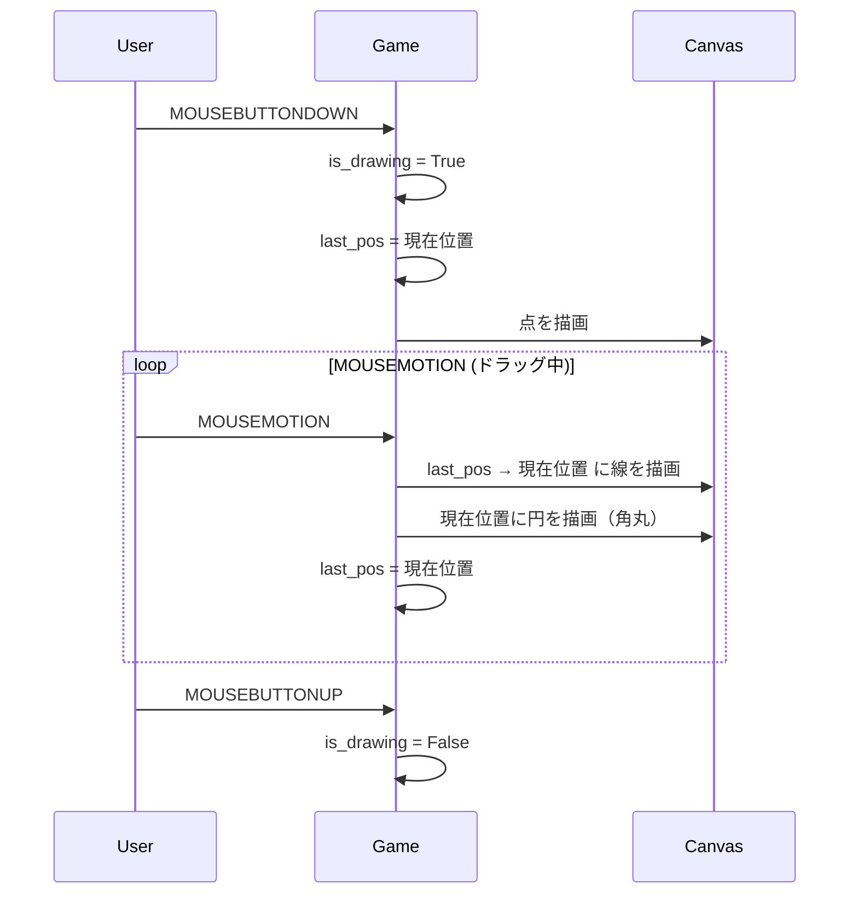

# 描画システム

## 概要

おえかきらくがきの描画システムは、pygame.Surface をキャンバスとして使用し、マウス/タッチ入力に応じて線を描画します。

## キャンバス管理

### キャンバスの構造

```python
# キャンバス領域の定義
self.canvas_rect = pygame.Rect(
    CANVAS_MARGIN,        # 左マージン
    HEADER_HEIGHT,        # ヘッダーの下から
    width - MARGIN * 2,   # 幅
    height - HEADER - TOOLBAR,  # 高さ
)

# キャンバス Surface の作成
self.canvas = pygame.Surface((canvas_rect.width, canvas_rect.height))
self.canvas.fill(WHITE)  # 白背景
```

### 座標変換

スクリーン座標からキャンバス座標への変換：

```python
def _get_canvas_pos(self, screen_pos: tuple[int, int]) -> tuple[int, int] | None:
    x, y = screen_pos
    if self.canvas_rect.collidepoint(x, y):
        return (x - self.canvas_rect.x, y - self.canvas_rect.y)
    return None
```

## 描画処理

### 線の描画



### 線を滑らかにする

線の端を丸くするため、線と円を組み合わせて描画：

```python
# 線を描画
pygame.draw.line(canvas, color, last_pos, current_pos, size)

# 端を丸くする
pygame.draw.circle(canvas, color, current_pos, size // 2)
```

## スタンプ描画

### プリミティブ描画

カスタム画像がない場合、Pygame プリミティブで描画：

```python
# 星（5角形）
def _draw_star(surface, x, y, size, color):
    points = []
    for i in range(5):
        # 外側の点
        angle = math.radians(i * 72 - 90)
        px = x + math.cos(angle) * size
        py = y + math.sin(angle) * size
        points.append((px, py))

        # 内側の点
        angle = math.radians(i * 72 - 90 + 36)
        px = x + math.cos(angle) * (size * 0.4)
        py = y + math.sin(angle) * (size * 0.4)
        points.append((px, py))

    pygame.draw.polygon(surface, color, points)
```

### カスタム画像

カスタム画像がある場合、スケールして描画：

```python
if stamp.image_key in self.custom_images:
    image = self.custom_images[stamp.image_key]
    scaled = pygame.transform.scale(image, (size * 2, size * 2))
    rect = scaled.get_rect(center=(x, y))
    self.canvas.blit(scaled, rect)
```

## 入力処理

### イベントの流れ

| イベント | 処理 |
|----------|------|
| MOUSEBUTTONDOWN | 描画開始 / スタンプ配置 / UI操作 |
| MOUSEMOTION | 描画継続（ドラッグ中のみ） |
| MOUSEBUTTONUP | 描画終了 |

### UI領域の判定

```python
# ボタン領域の判定
for i, rect in enumerate(self.color_rects):
    if rect.collidepoint(x, y):
        self.current_color = BABY_COLORS[i]
        return

# キャンバス領域の判定
canvas_pos = self._get_canvas_pos((x, y))
if canvas_pos:
    # 描画処理
```

## パフォーマンス考慮事項

1. **Surface の再利用**: キャンバスは毎フレーム作り直さない
2. **領域判定の効率化**: pygame.Rect.collidepoint() を使用
3. **描画の最小化**: 変更があった部分のみ更新

## トラブルシューティング

### 線が途切れる

- MOUSEMOTION の間隔が大きい場合に発生
- 解決策: 前回位置と現在位置を線で結ぶ

### 描画が遅い

- キャンバスサイズが大きすぎる可能性
- パーティクルなどの追加描画が多すぎる
