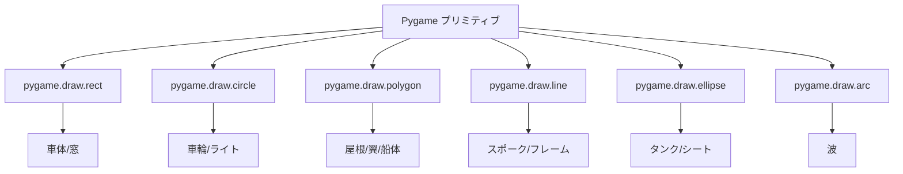
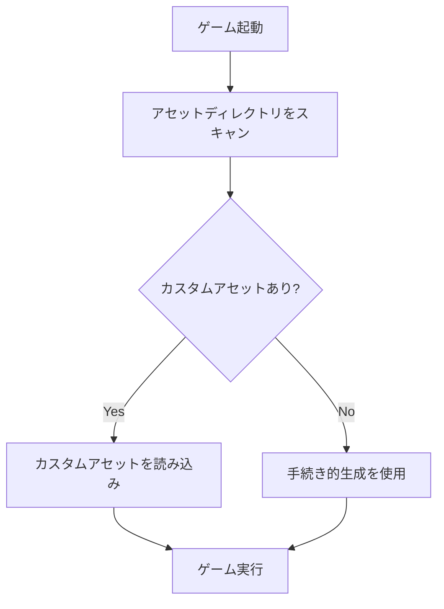

# 手続き的アセット生成の設計思想

## 概要

のりものビュンビュンでは、画像と音声をコードで動的に生成する「手続き的生成」を採用しています。
これにより、外部アセットなしでゲームが動作し、カスタマイズも容易になります。

## なぜ手続き的生成か？

### 比較表

| 観点 | 画像/音声ファイル | 手続き的生成 |
|------|------------------|--------------|
| 初期セットアップ | アセット準備が必要 | **すぐに動作** |
| ファイルサイズ | 大きい | **小さい** |
| カスタマイズ | ファイル差し替え | コード修正 or ファイル追加 |
| 品質 | **高品質** | シンプル |
| 動的変更 | 困難 | **容易** |

### 採用理由

1. **ゼロ依存**: 追加ファイルなしで動作
2. **軽量**: リポジトリサイズを最小化
3. **教育的価値**: コードで絵と音を作る仕組みを学べる
4. **フォールバック**: カスタムアセットがない場合の代替

## グラフィック生成

### Pygame プリミティブの活用



### 色の設計

幼児が認識しやすい明るい色を使用：

```python
# shared/constants.py から
BABY_RED = (255, 100, 100)
BABY_YELLOW = (255, 220, 100)
BABY_GREEN = (100, 220, 100)
BABY_BLUE = (100, 180, 255)
BABY_PURPLE = (200, 150, 255)
```

### 抽象化のレベル

詳細すぎず、認識できる程度の抽象化：

```
リアル ←──────────────────────→ 抽象

  🚗      ┌──┐      □
 写真    簡略化    図形のみ
         ↑
      この辺りを採用
```

## 音声生成

### 波形合成の基本

```
基本波（サイン波）:
     ╭─╮   ╭─╮
────╯   ╰─╯   ╰────

+ 倍音:
   ╭╮ ╭╮ ╭╮ ╭╮
───╯╰─╯╰─╯╰─╯╰────

= エンジン音的な複雑な波形
```

### 周波数による個性

各乗り物に異なる周波数を割り当てて個性を表現：

```
Hz
300 ─ ┌─────────────────────┐
     │ バイク (250)          │
200 ─ │ ひこうき (200)        │
     │ くるま (150)          │
100 ─ │ バス (100)            │
     │ でんしゃ (80)          │
 60 ─ │ ふね (60)             │
     └─────────────────────┘
```

## カスタムアセットとの共存

### ハイブリッドアプローチ



### メリット

1. **段階的改善**: まずは動作、後からアセット追加
2. **部分的カスタマイズ**: 一部だけカスタム画像を使用可能
3. **フォールバック**: アセット破損時も動作

## トレードオフ

### 手続き的生成の限界

| 限界 | 対策 |
|------|------|
| 複雑な絵は描けない | シンプルなデザインに徹する |
| リアルな音は難しい | 特徴的な音に絞る |
| 調整が難しい | パラメータ化で対応 |

### 品質向上の選択肢

1. **カスタムアセット**: 高品質な画像/音声ファイルを追加
2. **パラメータ調整**: 周波数や色を微調整
3. **プリミティブ追加**: より詳細な描画コードを追加

## まとめ

手続き的生成は「完璧な品質」ではなく「十分な品質」を目指す設計判断：

- **利点**: 軽量、依存なし、教育的
- **欠点**: 品質に限界
- **解決策**: カスタムアセットで補完可能

この設計により、ゲームは追加ファイルなしで動作しつつ、必要に応じて高品質なアセットに差し替えられます。
