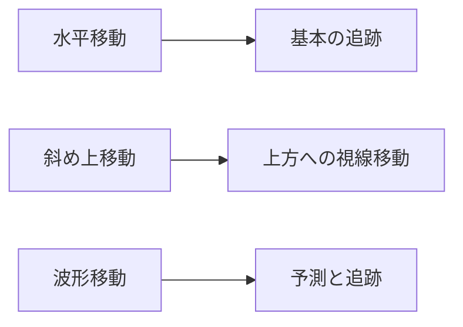

# 乗り物選定の設計思想

## 概要

のりものビュンビュンでは、1〜2歳児の発達段階と興味を考慮して8種類の乗り物を選定しました。

## 選定基準

### 1. 認知的親しみやすさ

幼児が日常生活で目にする機会が多い乗り物を優先：

| 優先度 | 乗り物 | 理由 |
|--------|--------|------|
| 高 | くるま | 最も身近、毎日見る |
| 高 | バス | 公共交通、大きくて目立つ |
| 高 | でんしゃ | 子供に人気、絵本にもよく登場 |
| 中 | しょうぼうしゃ | 赤い色、サイレンで印象的 |
| 中 | きゅうきゅうしゃ | サイレンで記憶に残る |
| 中 | ひこうき | 空を見上げると発見できる |
| 中 | バイク | 街でよく見かける |
| 中 | ふね | 絵本や映像で認識 |

### 2. 視覚的多様性

形状と色のバリエーションを確保：

```
形状の多様性:
┌─────────┬─────────┬─────────┐
│ 四角形  │ 細長い  │ 翼あり  │
│ (車系)  │ (電車)  │ (飛行機)│
└─────────┴─────────┴─────────┘

色の多様性:
🔴 赤: しょうぼうしゃ
🟡 黄: バス
🟢 緑: でんしゃ
🔵 青: ふね
⚪ 白: ひこうき、きゅうきゅうしゃ
🟣 紫: バイク
```

### 3. 聴覚的多様性

異なる種類の音で聴覚の発達を促進：

| 音のタイプ | 乗り物 | 教育的価値 |
|-----------|--------|-----------|
| エンジン音 | くるま、バス、バイク | 高低の違いを学ぶ |
| サイレン | 消防車、救急車 | 緊急車両の認識 |
| 汽笛 | ふね | 低い音の認識 |
| ジェット音 | ひこうき | 持続する音の認識 |

### 4. 動きの多様性

3種類の移動パターンで視覚追跡能力を発達：



## 8種類に絞った理由

### トレードオフ

| 数 | メリット | デメリット |
|----|---------|-----------|
| 4種類 | シンプル | 飽きやすい |
| **8種類** | **バランス良い** | - |
| 12種類以上 | 多様性 | 画面が煩雑、選択困難 |

### 画面レイアウトとの整合性

2行 × 4列のグリッドが幼児にとって最適：

- 一目で全体を把握できる
- 指でタップしやすいボタンサイズを確保
- 縦スクロール不要

## 除外した乗り物

| 乗り物 | 除外理由 |
|--------|---------|
| トラック | くるまと類似 |
| タクシー | くるまと類似 |
| ヘリコプター | ひこうきと動きが類似 |
| 潜水艦 | 日常で見る機会が少ない |
| ロケット | 抽象的すぎる |

## 将来の拡張

追加候補として検討：

1. **自転車** - 身近だが描画が複雑
2. **パトカー** - サイレン音が追加可能
3. **新幹線** - 人気があるが電車と類似
4. **クレーン車** - 働く車シリーズとして

## まとめ

8種類の乗り物は以下のバランスを考慮して選定：

- **認知発達**: 日常で見る乗り物
- **視覚発達**: 形と色の多様性
- **聴覚発達**: 音の種類の多様性
- **運動発達**: 動きの追跡能力
- **UI設計**: 2×4グリッドに最適
