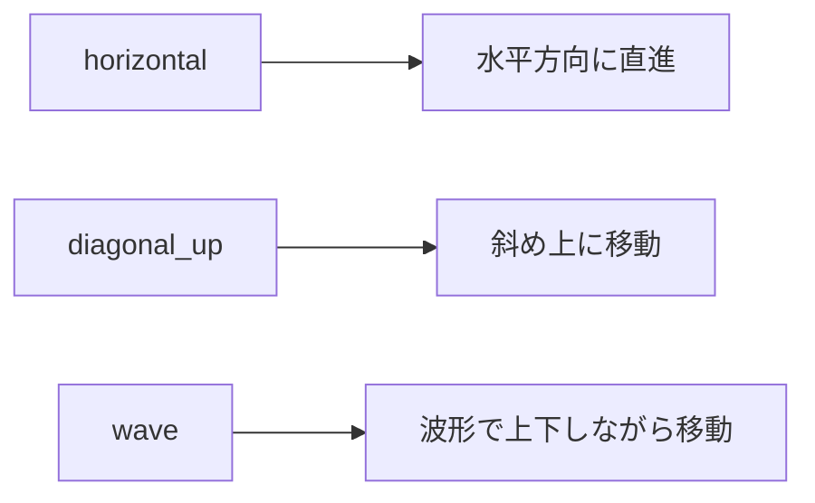

# アニメーションシステム

## 概要

のりものビュンビュンのアニメーションシステムは、3つの主要コンポーネントで構成されています：

1. **移動システム** - 乗り物の位置更新
2. **描画システム** - Pygame プリミティブによるベクター描画
3. **パーティクルシステム** - エフェクト表示

## 移動タイプ



### horizontal（水平移動）

```python
# 単純な水平移動
self.vehicle_x += vehicle.speed * dt
```

対象: くるま、バス、でんしゃ、しょうぼうしゃ、きゅうきゅうしゃ、バイク

### diagonal_up（斜め上移動）

```python
self.vehicle_x += vehicle.speed * dt
self.vehicle_y -= vehicle.speed * 0.3 * dt  # 上方向にも移動
```

対象: ひこうき

### wave（波形移動）

```python
self.vehicle_x += vehicle.speed * dt
self.vehicle_y = base_y + math.sin(self.vehicle_x / 50) * 15  # サイン波で上下
```

対象: ふね

## 車輪回転アニメーション

車輪はスポーク（放射状の線）で表現し、回転をシミュレート：

```python
# 回転角度を速度に応じて更新
self.wheel_rotation += vehicle.speed * dt * 0.5

# スポーク描画
for angle in [0, 90, 180, 270]:
    rad = math.radians(angle + self.wheel_rotation)
    sx = wheel_x + math.cos(rad) * spoke_len
    sy = wheel_y + math.sin(rad) * spoke_len
    pygame.draw.line(screen, color, (wheel_x, wheel_y), (sx, sy), 2)
```

## パーティクルシステム

### パーティクルデータ構造

```python
@dataclass
class Particle:
    x: float       # X座標
    y: float       # Y座標
    vx: float      # X方向速度
    vy: float      # Y方向速度
    life: float    # 残り寿命
    max_life: float  # 最大寿命
    color: tuple   # 色
    size: float    # サイズ
```

### パーティクルタイプ

| タイプ | 用途 | 色 | 挙動 |
|--------|------|-----|------|
| exhaust | 排気ガス | グレー | 左後方に拡散 |
| water | 水しぶき | 水色 | 左後方に飛散 |
| cloud | 雲 | 白 | 左にゆっくり流れる |

### 生成と更新

```python
# 一定確率でパーティクル生成
if random.random() < 0.3:
    self._spawn_particle(x, y, particle_type)

# 毎フレーム更新
for particle in self.particles:
    particle.x += particle.vx * dt
    particle.y += particle.vy * dt
    particle.life -= dt
    if particle.life <= 0:
        self.particles.remove(particle)
```

## フレームレート

- 目標: 60 FPS
- `dt`（デルタタイム）を使用してフレームレート非依存の動きを実現

## ベストプラクティス

1. **dt を常に使用** - 位置更新は必ず `dt` を掛ける
2. **パーティクル数を制限** - 生成確率で制御
3. **画面外判定** - `width + マージン` で判定

## トラブルシューティング

### アニメーションがカクつく

- `dt` が正しく渡されているか確認
- パーティクル数が多すぎないか確認

### 乗り物が画面外に消えない

- 画面外判定の閾値を確認（現在は `width + 200`）
