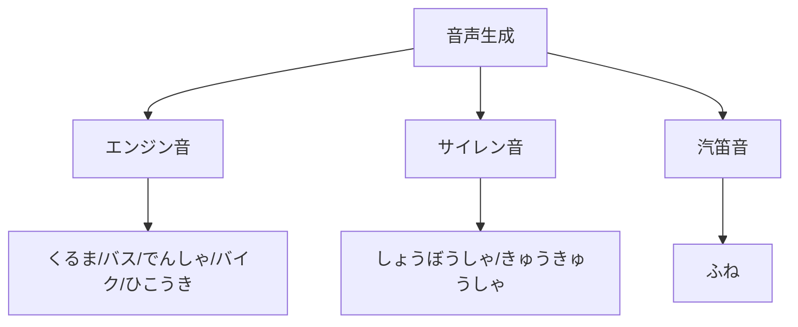
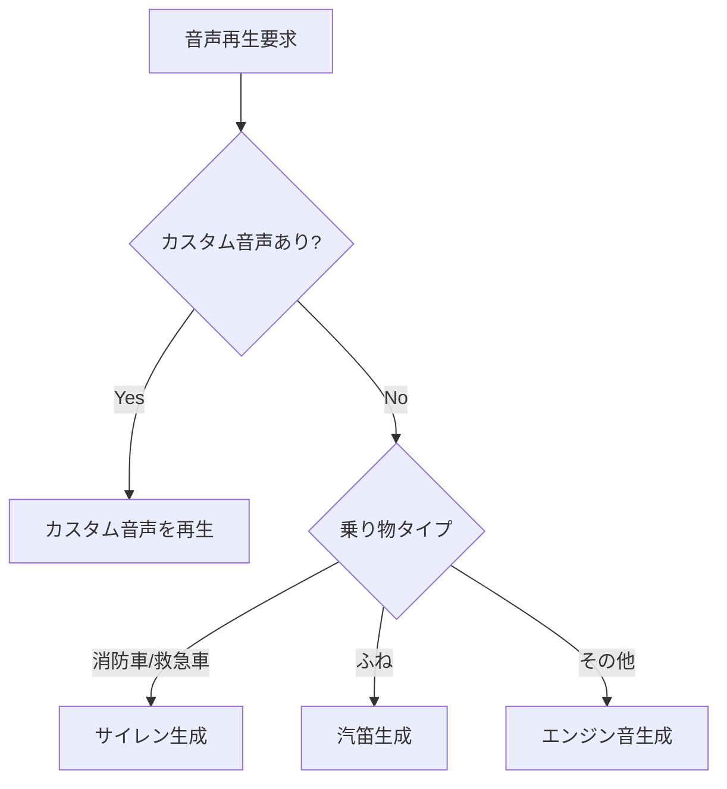

# 音声生成システム

## 概要

のりものビュンビュンでは、カスタム音声ファイルがない場合、手続き的に音声を生成します。
これにより、追加のアセットなしでゲームが動作します。

## 音声生成の種類



## エンジン音の生成

### 基本原理

複数のサイン波を重ね合わせて、エンジンの「うなり」を表現：

```python
def _create_engine_sound(self, freq: float, duration: float = 1.5):
    sample_rate = 22050
    samples = int(sample_rate * duration)

    for i in range(samples):
        t = i / sample_rate

        # 基本波 + 倍音
        value = math.sin(2 * math.pi * freq * t)
        value += 0.5 * math.sin(2 * math.pi * freq * 1.5 * t)
        value += 0.3 * math.sin(2 * math.pi * freq * 2 * t)

        # 振動感（8Hz で振幅変調）
        value *= 1 + 0.2 * math.sin(2 * math.pi * 8 * t)
```

### 乗り物別の周波数

| 乗り物 | 周波数 (Hz) | 特徴 |
|--------|------------|------|
| くるま | 150 | 標準的なエンジン音 |
| バス | 100 | 低い重厚な音 |
| でんしゃ | 80 | さらに低い音 |
| バイク | 250 | 高い軽快な音 |
| ひこうき | 200 | ジェット風の音 |

## サイレン音の生成

2つの周波数を交互に切り替えて「ピーポー」を表現：

```python
def _create_siren_sound(self, freq1: float, freq2: float):
    for i in range(samples):
        t = i / sample_rate

        # 0.5秒ごとに周波数を切り替え
        cycle = (t * 2) % 1.0
        freq = freq1 if cycle < 0.5 else freq2

        value = math.sin(2 * math.pi * freq * t)
```

- **freq1**: 400 Hz（低い方）
- **freq2**: 500 Hz（高い方）

## 汽笛音の生成

低い周波数の持続音に倍音を追加：

```python
def _create_horn_sound(self, freq: float):
    # 基本波 + 2倍音
    value = math.sin(2 * math.pi * freq * t)
    value += 0.3 * math.sin(2 * math.pi * freq * 2 * t)
```

- ふねの周波数: 60 Hz（非常に低い音）

## エンベロープ（音量変化）

すべての音声にエンベロープを適用して自然な音に：

```
音量
 ^
 |    ┌────────────────┐
 |   /                  \
 |  /                    \
 | /                      \
 +──────────────────────────> 時間
   ↑                    ↑
 Attack              Release
 (0.1s)              (0.3s)
```

```python
# エンベロープ計算
if t < 0.1:
    envelope = t / 0.1  # フェードイン
elif t < duration - 0.3:
    envelope = 1.0       # サスティン
else:
    envelope = (duration - t) / 0.3  # フェードアウト
```

## Pygame への変換

生成した波形を Pygame Sound オブジェクトに変換：

```python
import array

sound_array = array.array("h")  # 16-bit signed integer

for i in range(samples):
    # -1.0〜1.0 の値を -32767〜32767 に変換
    amplitude = int(15000 * envelope * value)
    amplitude = max(-32767, min(32767, amplitude))
    sound_array.append(amplitude)

sound = pygame.mixer.Sound(buffer=sound_array)
sound.set_volume(0.4)
```

## カスタム音声との優先順位



## トラブルシューティング

### 音が歪む

- 振幅が ±32767 を超えていないか確認
- `max(-32767, min(32767, amplitude))` でクリップ

### 音が途切れる

- `pygame.mixer.init()` が呼ばれているか確認
- duration が十分か確認

### 音量が大きすぎる/小さすぎる

- `sound.set_volume()` で調整（0.0〜1.0）
- 現在のデフォルト: 0.35〜0.4
