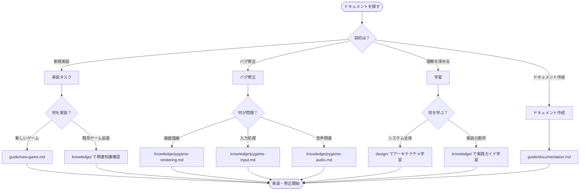

# Baby Fun Box - ドキュメント

このディレクトリには、Baby Fun Box プロジェクトの技術ドキュメントが含まれています。

## ⚡ クイックスタート

新しくプロジェクトに参加した方は、以下の順番で読むことを推奨します：

1. **[../CLAUDE.md](../CLAUDE.md)** - プロジェクト全体のガイドライン
2. **[knowledge/pygame-basics.md](./knowledge/pygame-basics.md)** - Pygame の基礎
3. **[design/game-architecture.md](./design/game-architecture.md)** - ゲームアーキテクチャ

---

## 📂 ディレクトリ構造

```
docs/
├── README.md          # このファイル（ドキュメント全体のインデックス）
├── knowledge/         # 実践的知識（HOW）
├── design/            # 設計思想（WHY）
├── guide/             # ガイドライン
└── _templates/        # ドキュメントテンプレート
```

---

## 🎯 いつ何を読むか - 決定木



---

## 📚 カテゴリ別ガイド

### 🔧 knowledge/ - 実践的知識

**いつ見る**: 実装時に「これを知らないとハマる」情報が必要なとき

**主要ドキュメント**:
- `pygame-basics.md` - Pygame の基礎（必読）
- `pygame-rendering.md` - 描画処理のベストプラクティス
- `pygame-input.md` - 入力処理のパターン
- `pygame-audio.md` - 音声処理のガイド

### 🏗️ design/ - 設計思想

**いつ見る**: システムの設計判断や「なぜそう設計したか」を理解したいとき

**主要ドキュメント**:
- `game-architecture.md` - ゲームアーキテクチャ設計
- `state-management.md` - 状態管理の設計

### 📖 guide/ - ガイドライン

**いつ見る**: 新しいコンテンツを追加するとき、配布パッケージを作成するとき

**主要ドキュメント**:
- `new-game.md` - 新しいゲームの追加方法
- `documentation.md` - ドキュメント作成ガイド
- `create-package.md` - 配布パッケージ作成ガイド
- `ubuntu-installation.md` - Ubuntu インストールガイド
- `deploy-to-device.md` - 実機への導入ガイド
- `build-and-deploy.md` - ビルドとデプロイの詳細

### 📝 _templates/ - テンプレート

**いつ見る**: 新しいドキュメントやゲームを作成するとき

---

## 🔍 ドキュメントの探し方

### 1. 目的別に探す

| 目的 | 参照先 |
|------|--------|
| 実装時の注意点を知りたい | `knowledge/` |
| 設計の背景を理解したい | `design/` |
| 新しいゲームを追加したい | `guide/new-game.md` |
| 配布パッケージを作成したい | `guide/create-package.md` |
| Ubuntu にインストールしたい | `guide/ubuntu-installation.md` |
| 実機に導入したい | `guide/deploy-to-device.md` |

### 2. キーワードで探す

各ドキュメントには `tags` が設定されています：

- **技術系**: `pygame`, `rendering`, `input`, `audio`, `animation`
- **機能系**: `game-loop`, `event-handling`, `collision`
- **配布系**: `build`, `package`, `install`, `deploy`, `ubuntu`
- **分類系**: `best-practice`, `troubleshooting`

---

## 🤝 貢献する

### ドキュメントを追加する

1. 適切なカテゴリ（knowledge/design/guide）を選択
2. テンプレート（`_templates/`）を使用
3. frontmatter を設定（title, category, tags, related）
4. 関連ドキュメントに相互リンクを追加
