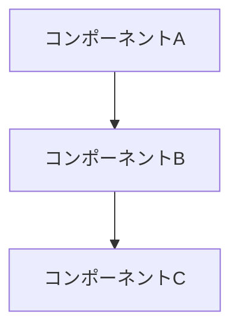
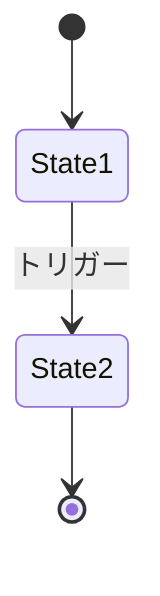

# {タイトル}

## 概要

この設計ドキュメントでは...

---

## 背景と動機

### 解決したい問題

- ...

### 設計の目標

- ...

---

## 設計の詳細

### 全体構成



### クラス設計

```python
class Example:
    """クラスの説明"""

    def method(self) -> None:
        """メソッドの説明"""
        pass
```

### 状態遷移（該当する場合）



---

## トレードオフ

### 選択肢の比較

| 選択肢 | メリット | デメリット |
|--------|----------|------------|
| A | ... | ... |
| B | ... | ... |

### 選んだ理由

...

---

## 実装ガイド

### 基本パターン

```python
# 推奨される実装パターン
```

### 注意点

- ...

---

## チェックリスト

- [ ] 項目1
- [ ] 項目2
- [ ] 項目3

---

## 関連ドキュメント

- [関連設計ドキュメント](./related-design.md)
- [関連知識ドキュメント](../knowledge/related-knowledge.md)
