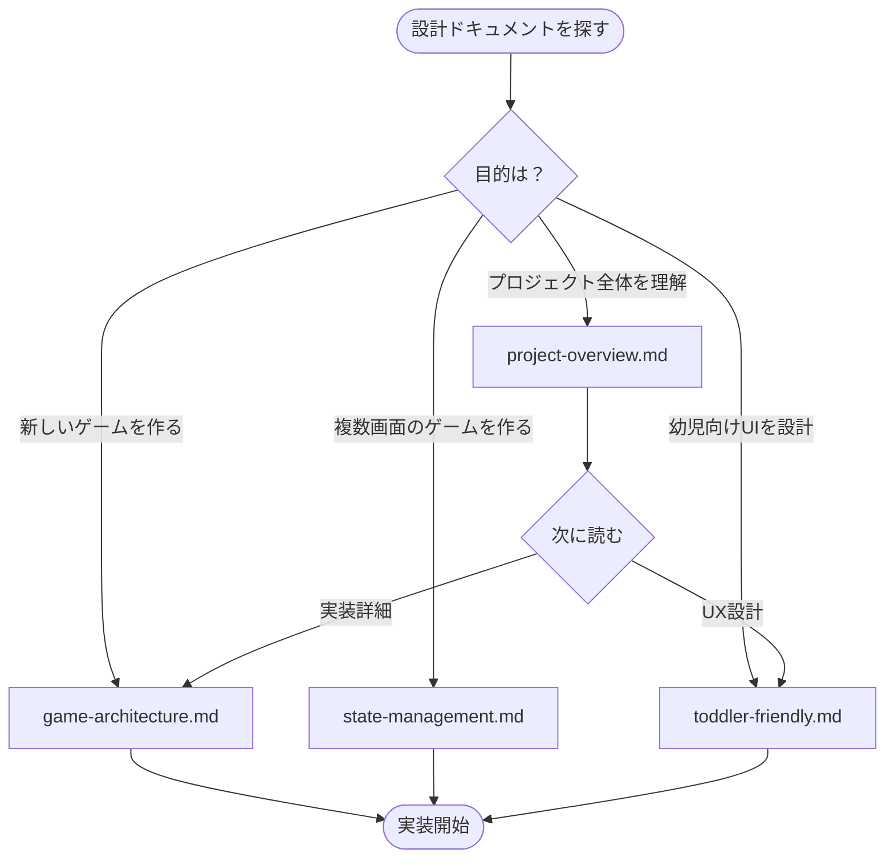

# Design - 設計思想

このディレクトリには、Baby Fun Box プロジェクトの設計思想をまとめています。

---

## ドキュメント一覧

| ドキュメント | 説明 | 対象 |
|-------------|------|------|
| [project-overview.md](./project-overview.md) | プロジェクト全体のアーキテクチャ | すべての開発者 |
| [game-architecture.md](./game-architecture.md) | BaseGame パターン設計 | すべての開発者 |
| [state-management.md](./state-management.md) | GameState Enum による状態管理 | 複数画面を持つゲーム開発者 |
| [toddler-friendly.md](./toddler-friendly.md) | 幼児向け UX 設計原則 | すべての開発者 |

---

## いつ何を読むか



---

## クイックリファレンス

### BaseGame パターン

```python
from shared.base_game import BaseGame

class MyGame(BaseGame):
    name = "My Game"
    description = "ゲームの説明"

    def handle_events(self, events): ...
    def update(self, dt): ...
    def draw(self): ...
```

→ 詳細: [game-architecture.md](./game-architecture.md)

### 状態管理パターン

```python
from enum import Enum, auto

class GameState(Enum):
    START = auto()
    PLAYING = auto()
    RESULT = auto()
```

→ 詳細: [state-management.md](./state-management.md)

### 幼児向け UX 原則

| 原則 | 基準 |
|------|------|
| タッチターゲット | 80px 以上 |
| フィードバック | 即座（視覚 + 聴覚） |
| 評価 | すべてポジティブ |
| ゲームサイクル | 30秒〜1分 |

→ 詳細: [toddler-friendly.md](./toddler-friendly.md)

---

## 読む順序（推奨）

1. **[project-overview.md](./project-overview.md)** - 全体像を把握
2. **[game-architecture.md](./game-architecture.md)** - BaseGame パターンを理解
3. **[toddler-friendly.md](./toddler-friendly.md)** - UX 原則を理解
4. **[state-management.md](./state-management.md)** - 必要に応じて

---

## 関連ドキュメント

- [knowledge/](../knowledge/README.md) - 実践的な実装知識
- [shared/README.md](../../shared/README.md) - 共有ライブラリ API
- [docs/README.md](../README.md) - ドキュメント全体のインデックス
