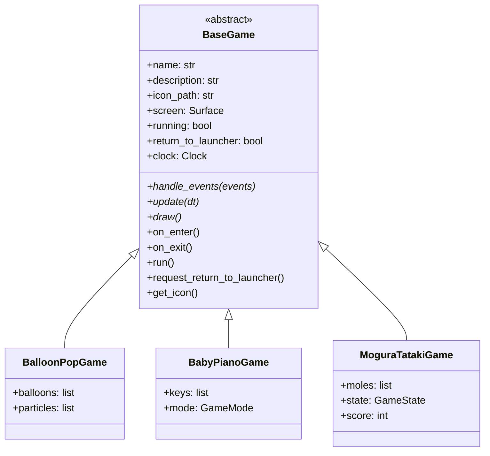
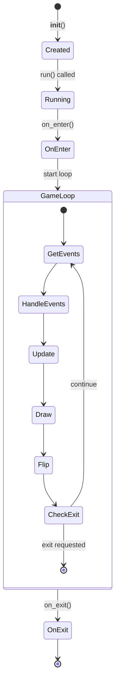

# ゲームアーキテクチャ設計

## 概要

Baby Fun Box のゲームアーキテクチャ設計について解説します。全てのゲームは `BaseGame` クラスを継承し、統一されたインターフェースでランチャーから起動されます。

---

## BaseGame パターン

### クラス構造



### 抽象メソッド

サブクラスで **必ず実装する** メソッド：

| メソッド | 引数 | 責務 |
|---------|------|------|
| `handle_events()` | `events: list[Event]` | ユーザー入力の処理 |
| `update()` | `dt: float` | ゲーム状態の更新 |
| `draw()` | なし | 画面への描画 |

### オーバーライド可能なメソッド

必要に応じて **オーバーライドできる** メソッド：

| メソッド | タイミング | 用途 |
|---------|-----------|------|
| `on_enter()` | ゲーム開始時 | リソース読み込み、初期化 |
| `on_exit()` | ゲーム終了時 | リソース解放、クリーンアップ |

---

## なぜ BaseGame を使うか

### 1. ランチャーとの統合

全てのゲームが同じインターフェースを持つことで、ランチャーから統一的に起動できます：

```python
# ランチャー側のコード
def launch_game(game_class: type[BaseGame]) -> None:
    game = game_class(self.screen)
    game.run()
    # ゲーム終了後、自動的にランチャーに戻る
```

### 2. 共通処理の集約

以下の処理が `BaseGame` で自動的に行われます：

- FPS 制限（60FPS）
- `pygame.QUIT` イベントの処理
- デルタタイムの計算
- `pygame.display.flip()` の呼び出し

### 3. テスト容易性

責務が分離されているため、個別にテストできます：

```python
def test_handle_events():
    game = MyGame(mock_screen)
    events = [create_click_event(100, 100)]
    game.handle_events(events)
    assert game.clicked == True
```

---

## ライフサイクル



### 詳細フロー

```python
# 1. インスタンス生成
game = BalloonPopGame(screen)

# 2. run() 呼び出し
game.run()
    # 2.1 on_enter() - リソース読み込み
    game.on_enter()

    # 2.2 ゲームループ
    while game.running and not game.return_to_launcher:
        dt = clock.tick(60) / 1000.0
        events = pygame.event.get()

        # 共通イベント処理（QUIT）
        for event in events:
            if event.type == pygame.QUIT:
                game.running = False

        # ゲーム固有処理
        game.handle_events(events)
        game.update(dt)
        game.draw()
        pygame.display.flip()

    # 2.3 on_exit() - クリーンアップ
    game.on_exit()
```

---

## 責務分離

### handle_events - イベント処理

**役割**: ユーザー入力を解釈し、ゲーム状態を変更する

```python
def handle_events(self, events: list[pygame.event.Event]) -> None:
    for event in events:
        if event.type == pygame.MOUSEBUTTONDOWN:
            self._handle_click(event.pos)
        elif event.type == pygame.KEYDOWN:
            if event.key == pygame.K_ESCAPE:
                self.request_return_to_launcher()
```

**注意**: 描画処理をここで行わない

### update - 状態更新

**役割**: 時間経過によるゲーム状態の更新

```python
def update(self, dt: float) -> None:
    # アニメーション更新
    for balloon in self.balloons:
        balloon.y -= balloon.speed * dt

    # 画面外のオブジェクト削除
    self.balloons = [b for b in self.balloons if b.y > -b.radius]

    # タイマー更新
    if self.state == GameState.PLAYING:
        self.remaining_time -= dt
```

**注意**: `dt`（秒単位のデルタタイム）を使用して時間依存の処理を行う

### draw - 描画

**役割**: 現在の状態を画面に描画する

```python
def draw(self) -> None:
    # 1. 背景クリア
    self.screen.fill(BACKGROUND_LIGHT)

    # 2. ゲームオブジェクト描画
    for balloon in self.balloons:
        balloon.draw(self.screen)

    # 3. UI 描画
    self.back_button.draw(self.screen)
```

**注意**: `pygame.display.flip()` は `BaseGame.run()` で呼ばれるため不要

---

## ディレクトリ構造

```
apps/{game-name}/
├── __init__.py          # モジュール初期化（GameClassをエクスポート）
├── main.py              # 単体実行用エントリーポイント
├── game.py              # BaseGame 継承クラス
├── assets/              # リソース（画像、音声）
│   ├── images/
│   └── sounds/
├── docs/                # ゲーム固有ドキュメント
│   ├── README.md
│   └── how-to-play.md
└── README.md            # ゲーム概要
```

### __init__.py の例

```python
from .game import BalloonPopGame

__all__ = ["BalloonPopGame"]
```

### main.py の例

```python
"""単体実行用エントリーポイント"""
import pygame
from shared.constants import DEFAULT_WIDTH, DEFAULT_HEIGHT
from .game import BalloonPopGame

def main() -> None:
    pygame.init()
    screen = pygame.display.set_mode((DEFAULT_WIDTH, DEFAULT_HEIGHT))
    pygame.display.set_caption("Balloon Pop")

    game = BalloonPopGame(screen)
    game.run()

    pygame.quit()

if __name__ == "__main__":
    main()
```

---

## トレードオフ

### 継承 vs コンポジション

Baby Fun Box では **継承** を採用していますが、それぞれの特徴があります：

| 観点 | 継承（現在の設計） | コンポジション |
|------|------------------|---------------|
| 実装の簡潔さ | ✅ シンプル | やや複雑 |
| 柔軟性 | 単一継承のみ | 高い |
| コード再利用 | 基底クラスで共通化 | 部品として再利用 |
| テスト | やや難しい | 容易 |

### 継承を選んだ理由

1. **シンプルさ優先**: 各ゲームの実装を簡潔に保つ
2. **統一インターフェース**: ランチャーからの一貫した呼び出し
3. **プロジェクト規模**: 小規模プロジェクトでは継承で十分

### 将来の拡張

ゲーム数が増え、複雑な機能共有が必要になった場合は、コンポジションベースの設計に移行を検討：

```python
# 将来の設計案（コンポジション）
class Game:
    def __init__(self):
        self.input_handler = InputHandler()
        self.renderer = Renderer()
        self.audio = AudioManager()
```

---

## 関連ドキュメント

- [状態管理設計](./state-management.md) - GameState パターン
- [幼児向け UX 設計](./toddler-friendly.md) - タッチターゲット等
- [Pygame 基礎](../knowledge/pygame-basics.md) - ゲームループの詳細
- [Shared Library API](../../shared/README.md) - BaseGame の実装詳細
