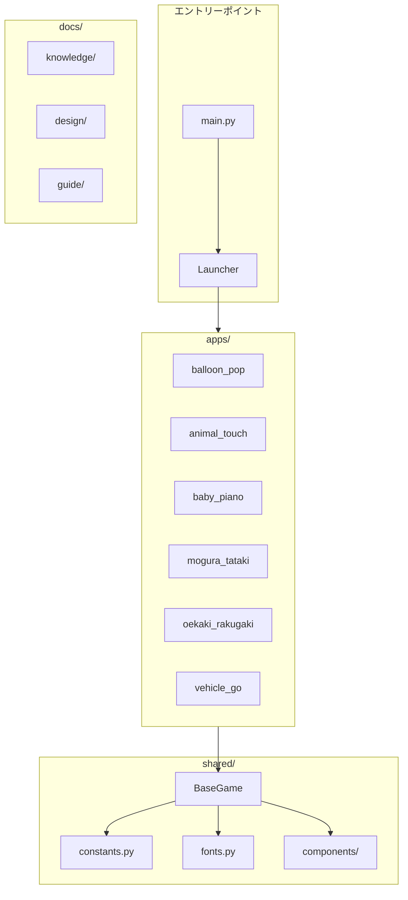
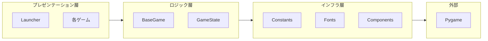
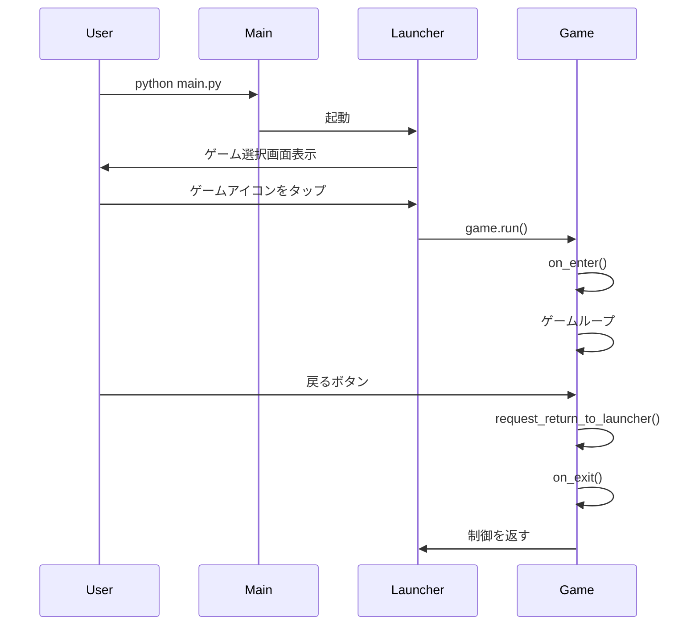
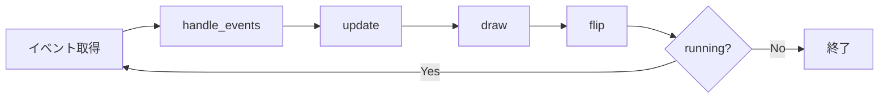
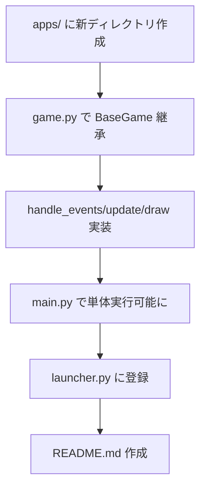

# プロジェクト全体設計

## 概要

Baby Fun Box は 1〜2歳児向けのゲームコレクションです。このドキュメントでは、プロジェクト全体のアーキテクチャと設計思想を解説します。

---

## 設計目標

| 目標 | 説明 |
|------|------|
| **モジュール性** | 各ゲームが独立して開発・テスト可能 |
| **一貫性** | 全ゲームで統一された UX と操作性 |
| **拡張性** | 新しいゲームを容易に追加可能 |
| **保守性** | 共通コードの重複を排除 |

---

## 全体アーキテクチャ



---

## レイヤー構成



---

## ディレクトリ構造

```
baby-fun-box/
├── main.py                 # 統合エントリーポイント
├── launcher.py             # ゲーム選択画面
├── CLAUDE.md               # プロジェクトガイドライン
├── requirements.txt        # Python 依存関係
│
├── apps/                   # ゲームアプリケーション
│   ├── balloon_pop/        # バルーンポップ
│   ├── animal_touch/       # どうぶつタッチ
│   ├── baby_piano/         # ベビーピアノ
│   ├── mogura_tataki/      # もぐらたたき
│   ├── oekaki_rakugaki/    # お絵かきらくがき
│   └── vehicle_go/         # のりものビュンビュン
│
├── shared/                 # 共有ライブラリ
│   ├── __init__.py
│   ├── base_game.py        # BaseGame 基底クラス
│   ├── constants.py        # 定数定義
│   ├── fonts.py            # フォント管理
│   └── components/         # UI コンポーネント
│       ├── __init__.py
│       └── button.py
│
├── docs/                   # ドキュメント
│   ├── README.md           # ドキュメントインデックス
│   ├── knowledge/          # 実践的知識（HOW）
│   ├── design/             # 設計思想（WHY）
│   ├── guide/              # ガイドライン
│   └── _templates/         # テンプレート
│
└── scripts/                # ビルド・デプロイスクリプト
    ├── build.sh
    └── install.sh
```

---

## データフロー

### ゲーム起動フロー



### ゲームループ内のフロー



---

## コンポーネント詳細

### main.py

```python
# 統合エントリーポイント
pygame.init()
pygame.mixer.init()
screen = pygame.display.set_mode(...)
launcher = Launcher(screen)
launcher.run()
```

### Launcher

| 責務 | 説明 |
|------|------|
| ゲーム一覧表示 | 登録されたゲームのアイコンをグリッド表示 |
| ゲーム起動 | 選択されたゲームの `run()` を呼び出し |
| 戻り処理 | ゲームから戻ってきたら一覧に復帰 |

### BaseGame

| メソッド | 責務 |
|---------|------|
| `__init__` | 画面サイズ、クロック初期化 |
| `on_enter` | リソース読み込み |
| `handle_events` | イベント処理（抽象） |
| `update` | 状態更新（抽象） |
| `draw` | 描画（抽象） |
| `on_exit` | クリーンアップ |
| `run` | ゲームループ実行 |

→ 詳細: [game-architecture.md](./game-architecture.md)

---

## 共有リソース

### constants.py

```python
# 画面設定
DEFAULT_WIDTH = 1024
DEFAULT_HEIGHT = 768
FPS = 60

# 幼児向け色パレット
BABY_COLORS = [BABY_RED, BABY_YELLOW, ...]

# UI 設定
MIN_TOUCH_SIZE = 80  # 最小タッチサイズ
```

### fonts.py

```python
def get_font(size: int) -> pygame.font.Font:
    """日本語対応フォントを取得"""
```

### components/

| コンポーネント | 用途 |
|---------------|------|
| `Button` | 汎用ボタン |
| `IconButton` | アイコン付きボタン（ランチャー用） |
| `BackButton` | 戻るボタン（全ゲーム共通） |

→ 詳細: [shared/README.md](../../shared/README.md)

---

## ゲーム追加の流れ



→ 詳細: [guide/new-game.md](../guide/new-game.md)

---

## 設計原則

### 1. 単一責任

各ゲームは独自のディレクトリを持ち、他のゲームに依存しない。

### 2. 継承より委譲（ただし BaseGame は例外）

共通機能は `shared/` に集約し、ゲームはそれを利用する。

### 3. 設定より規約

- ゲームは `apps/{name}/` に配置
- エントリーポイントは `main.py`
- アセットは `assets/` に配置

### 4. 幼児ファースト

全ての設計判断で「1〜2歳児に適しているか」を考慮。

→ 詳細: [toddler-friendly.md](./toddler-friendly.md)

---

## 拡張ポイント

| 拡張 | 方法 |
|------|------|
| 新しいゲーム追加 | `apps/` に新ディレクトリを作成 |
| 新しいコンポーネント | `shared/components/` に追加 |
| 新しい定数 | `shared/constants.py` に追加 |
| 新しい共通機能 | `shared/` に新モジュールを追加 |

---

## 関連ドキュメント

- [ゲームアーキテクチャ設計](./game-architecture.md) - BaseGame パターン
- [幼児向け UX 設計](./toddler-friendly.md) - UX 原則
- [Pygame 基礎](../knowledge/pygame-basics.md) - ゲームループ
- [Shared Library API](../../shared/README.md) - 共有ライブラリ
- [新規ゲーム追加ガイド](../guide/new-game.md) - ゲーム追加手順
