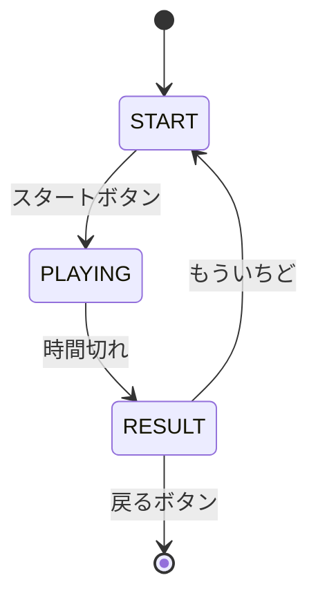
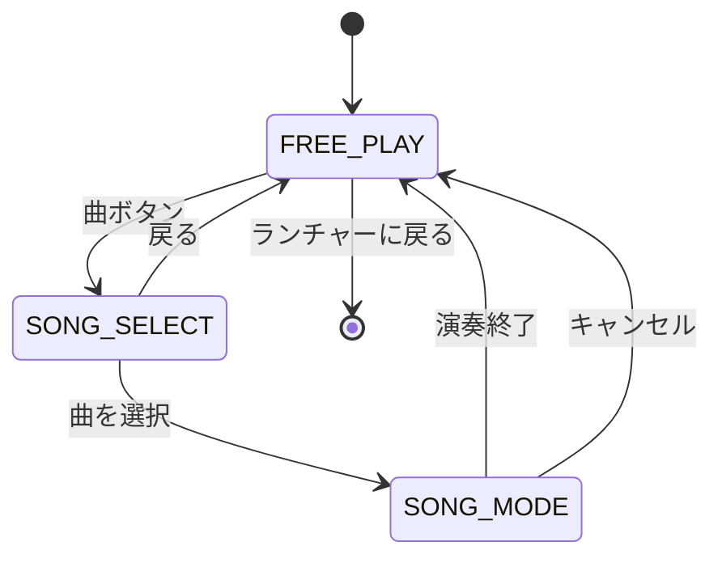
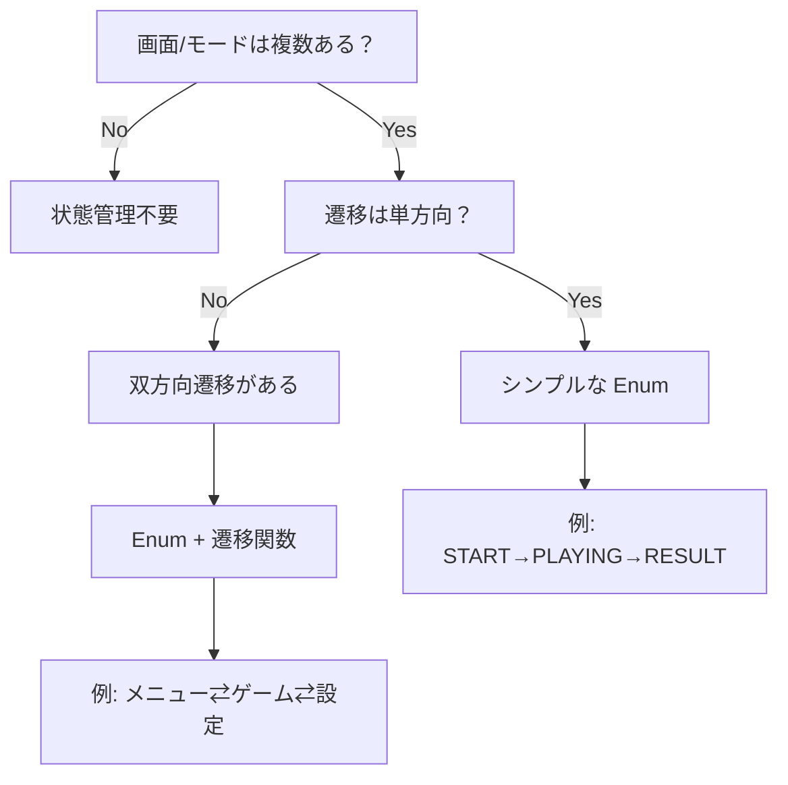

# 状態管理設計

## 概要

ゲームの状態管理パターンについて解説します。複数の画面やモードを持つゲームでは、状態を明示的に管理することで、コードの可読性と保守性を向上させます。

---

## 状態管理が必要な場面

### 例1: もぐらたたき

```
START（スタート画面）→ PLAYING（ゲーム中）→ RESULT（結果表示）
```

### 例2: ベビーピアノ

```
FREE_PLAY（自由演奏）⇄ SONG_SELECT（曲選択）⇄ SONG_MODE（曲演奏）
```

### 判断基準

| 状況 | 状態管理 |
|------|---------|
| 画面が1つ、モードなし | 不要 |
| 複数画面、単方向遷移 | シンプルな Enum |
| 複数モード、双方向遷移 | Enum + 遷移関数 |

---

## Enum による状態定義

### 基本パターン

```python
from enum import Enum, auto

class GameState(Enum):
    """ゲーム状態"""
    START = auto()    # スタート画面
    PLAYING = auto()  # ゲーム中
    RESULT = auto()   # 結果表示
```

### 使用例（もぐらたたき）

```python
class MoguraTatakiGame(BaseGame):
    def __init__(self, screen: pygame.Surface) -> None:
        super().__init__(screen)
        self.game_state = GameState.START
        self.score = 0
        self.remaining_time = 30.0

    def handle_events(self, events: list[pygame.event.Event]) -> None:
        for event in events:
            if event.type == pygame.MOUSEBUTTONDOWN:
                x, y = event.pos

                if self.game_state == GameState.START:
                    if self.start_button_rect.collidepoint(x, y):
                        self.game_state = GameState.PLAYING
                        self._reset_game()

                elif self.game_state == GameState.RESULT:
                    if self.retry_button_rect.collidepoint(x, y):
                        self.game_state = GameState.START

                elif self.game_state == GameState.PLAYING:
                    self._handle_tap(x, y)
```

---

## 状態遷移図

### もぐらたたきの例



### ベビーピアノの例



---

## 状態に応じた描画

### 条件分岐パターン

```python
def draw(self) -> None:
    if self.game_state == GameState.START:
        self._draw_start_screen()
    elif self.game_state == GameState.PLAYING:
        self._draw_playing_screen()
    elif self.game_state == GameState.RESULT:
        self._draw_result_screen()
```

### ディスパッチテーブルパターン

```python
class Game(BaseGame):
    def __init__(self, screen: pygame.Surface) -> None:
        super().__init__(screen)
        self.state = GameState.START

        # 状態ごとの描画関数をマッピング
        self._draw_methods = {
            GameState.START: self._draw_start_screen,
            GameState.PLAYING: self._draw_playing_screen,
            GameState.RESULT: self._draw_result_screen,
        }

    def draw(self) -> None:
        draw_method = self._draw_methods.get(self.state)
        if draw_method:
            draw_method()
```

---

## 状態遷移のベストプラクティス

### 1. 明示的な遷移関数

```python
def _transition_to(self, new_state: GameState) -> None:
    """状態遷移を一箇所で管理"""
    old_state = self.game_state

    # 退出処理
    if old_state == GameState.PLAYING:
        self._stop_bgm()

    # 状態変更
    self.game_state = new_state

    # 進入処理
    if new_state == GameState.PLAYING:
        self._reset_game()
        self._start_bgm()
    elif new_state == GameState.RESULT:
        self._play_finish_sound()
```

### 2. 状態進入時のリセット

```python
def _reset_game(self) -> None:
    """ゲーム状態をリセット"""
    self.score = 0
    self.remaining_time = 30.0
    self.objects.clear()
```

### 3. 状態の検証

```python
def _can_transition_to(self, new_state: GameState) -> bool:
    """遷移が有効かチェック"""
    valid_transitions = {
        GameState.START: [GameState.PLAYING],
        GameState.PLAYING: [GameState.RESULT],
        GameState.RESULT: [GameState.START],
    }
    return new_state in valid_transitions.get(self.game_state, [])
```

---

## アンチパターン

### 1. フラグの乱立

```python
# 悪い例
self.is_started = False
self.is_playing = False
self.is_finished = False
self.show_result = False

# 良い例
self.state = GameState.START
```

### 2. 暗黙的な状態遷移

```python
# 悪い例
def update(self, dt: float) -> None:
    if self.remaining_time <= 0:
        self.game_state = GameState.RESULT  # 突然変わる

# 良い例
def update(self, dt: float) -> None:
    if self.remaining_time <= 0:
        self._transition_to(GameState.RESULT)  # 明示的
```

### 3. 状態チェックの漏れ

```python
# 悪い例
def _handle_tap(self, x: int, y: int) -> None:
    # 状態をチェックせずに処理
    for obj in self.objects:
        if obj.is_hit(x, y):
            self.score += 1

# 良い例
def _handle_tap(self, x: int, y: int) -> None:
    if self.game_state != GameState.PLAYING:
        return  # PLAYING 以外では無視

    for obj in self.objects:
        if obj.is_hit(x, y):
            self.score += 1
```

---

## 決定木: 状態管理の選択



---

## 実装チェックリスト

- [ ] `GameState` Enum を定義した
- [ ] 初期状態を `__init__` で設定した
- [ ] 各状態で必要な処理を分離した（描画、更新、イベント）
- [ ] 状態遷移を明示的な関数で行っている
- [ ] 無効な状態での処理を防いでいる
- [ ] 状態遷移図を文書化した

---

## 関連ドキュメント

- [ゲームアーキテクチャ設計](./game-architecture.md) - BaseGame パターン
- [幼児向け UX 設計](./toddler-friendly.md) - ゲームフロー設計
- [Pygame 基礎](../knowledge/pygame-basics.md) - ゲームループ
