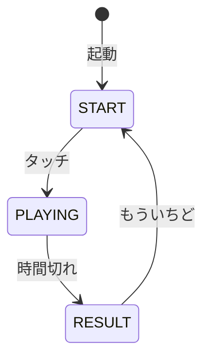
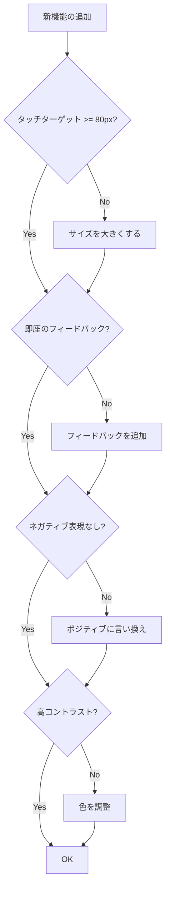

# 幼児向け UX 設計

## 概要

Baby Fun Box は 1〜2 歳児を対象としたゲームコレクションです。このドキュメントでは、幼児向け UX 設計の原則とベストプラクティスを解説します。

---

## 対象年齢の特性

### 1〜2歳児の発達段階

| 側面 | 特性 | 設計への影響 |
|------|------|-------------|
| 視覚 | 発達途中、大きいものが見やすい | 大きな要素、高コントラスト |
| 運動 | 粗大運動が優位、細かい操作は苦手 | 大きなタッチターゲット |
| 認知 | 因果関係の学習中 | 即座のフィードバック |
| 集中 | 短い（数十秒〜数分） | 短いゲームサイクル |
| 感情 | ポジティブな体験が重要 | 失敗のない設計 |

---

## タッチターゲット設計

### 最小サイズ

```python
from shared.constants import MIN_TOUCH_SIZE

# MIN_TOUCH_SIZE = 80  # ピクセル
```

| 要素 | 最小サイズ | 推奨サイズ |
|------|-----------|-----------|
| ボタン | 60px | 80-100px |
| ゲームオブジェクト | 80px | 100-150px |
| 戻るボタン | 60px | 80px |

### 実装例

```python
class Button:
    def __init__(self, x: int, y: int, width: int, height: int):
        # 最小サイズを保証
        width = max(width, MIN_TOUCH_SIZE)
        height = max(height, MIN_TOUCH_SIZE)
        self.rect = pygame.Rect(x, y, width, height)
```

### 寛容な当たり判定

```python
class GameObject:
    def __init__(self, x: float, y: float, radius: float):
        self.x = x
        self.y = y
        self.radius = radius
        # 当たり判定を実際のサイズより大きく
        self.hit_radius = radius * 1.2

    def is_hit(self, pos: tuple[int, int]) -> bool:
        dx = pos[0] - self.x
        dy = pos[1] - self.y
        distance = math.sqrt(dx * dx + dy * dy)
        return distance <= self.hit_radius
```

---

## 視覚設計

### BABY_COLORS パレット

```python
# shared/constants.py
BABY_COLORS = [
    (255, 89, 94),    # BABY_RED
    (255, 202, 58),   # BABY_YELLOW
    (138, 201, 38),   # BABY_GREEN
    (25, 130, 196),   # BABY_BLUE
    (106, 76, 147),   # BABY_PURPLE
    (255, 146, 76),   # BABY_ORANGE
    (255, 119, 168),  # BABY_PINK
]
```

**色の特徴**:

- 高彩度で目を引く
- 互いに区別しやすい
- 暖かみのある色調

### 高コントラスト

```python
# 背景は淡い色
BACKGROUND_LIGHT = (240, 248, 255)  # アリスブルー

# オブジェクトは鮮やかな色
object_color = BABY_RED  # 背景と明確に区別

# テキストは黒または濃い色
TEXT_COLOR = BLACK
```

### シンプルな形状

```python
def draw_character(screen: pygame.Surface, x: int, y: int) -> None:
    # 丸みのある基本形状
    pygame.draw.circle(screen, color, (x, y), radius)  # 顔
    pygame.draw.circle(screen, BLACK, (x - 15, y - 10), 8)  # 目
    pygame.draw.circle(screen, BLACK, (x + 15, y - 10), 8)  # 目

    # 複雑なディテールは避ける
```

---

## フィードバック設計

### 即座の反応

```python
def _handle_touch(self, pos: tuple[int, int]) -> None:
    for obj in self.objects:
        if obj.is_hit(pos):
            # 遅延なし（同じフレーム内で）
            self._play_sound()           # 聴覚
            self._create_particles(obj)  # 視覚
            self._animate_bounce(obj)    # 視覚
            self.score += 1              # スコア
            break
```

### 視覚 + 聴覚の組み合わせ

| アクション | 視覚フィードバック | 聴覚フィードバック |
|-----------|------------------|------------------|
| タッチ成功 | バウンスアニメーション | 明るい達成音 |
| オブジェクト出現 | フェードイン | 軽いポップ音 |
| ゲーム終了 | 大きなスコア表示 | ファンファーレ |

### ポジティブな音

```python
def create_success_sound() -> pygame.mixer.Sound:
    """明るい上昇音を生成"""
    frequencies = [523, 659, 784]  # C5, E5, G5（メジャーコード）
    # ...
```

**音の設計原則**:

- 高めの周波数（明るい印象）
- 短い持続時間（0.1〜0.3秒）
- 和音を使用（達成感）
- 怖い音や警告音は使わない

---

## ゲームフロー設計

### 短いサイクル

```python
GAME_TIME = 30.0  # 30秒

# なぜ30秒か？
# - 1〜2歳児の集中力に合わせる
# - 短いサイクルで達成感を何度も味わえる
# - 60秒では長すぎて飽きる可能性
```

### 明確な開始と終了



### リプレイしやすい

```python
def _draw_result_screen(self) -> None:
    # 大きな「もういちど」ボタン
    retry_button = pygame.Rect(
        self.width // 2 - 150,
        self.height - 200,
        300,  # 大きめ
        100   # 大きめ
    )
```

---

## スコア/評価の設計

### すべてポジティブ

```python
def _get_praise(self, score: int) -> str:
    """スコアに応じた褒め言葉（すべてポジティブ）"""
    if score >= 15:
        return "すごーい！"
    elif score >= 10:
        return "がんばったね！"
    elif score >= 5:
        return "いいね！"
    else:
        return "たのしかったね！"  # 最低でもポジティブ
```

**設計原則**:

- **失敗を示す言葉は使わない**
- **「0点」でも「たのしかったね！」**
- 遊んだこと自体を肯定する
- 結果より過程を重視

### 数値の可視化

```python
def _draw_score(self) -> None:
    # 大きなフォントで表示
    font = get_font(120)
    text = font.render(str(self.score), True, BABY_YELLOW)
    # 中央に配置
```

---

## 設計チェックリスト



### チェック項目

- [ ] タッチターゲットが 80px 以上
- [ ] 当たり判定が寛容（少し大きめ）
- [ ] タッチに即座に反応する
- [ ] 視覚と聴覚の両方でフィードバック
- [ ] BABY_COLORS を使用
- [ ] 背景と要素のコントラストが高い
- [ ] ネガティブな言葉を使っていない
- [ ] ゲームサイクルが短い（30秒〜1分）
- [ ] 失敗する状況がない
- [ ] 音が怖くない

---

## 実装例: 幼児向けボタン

```python
from shared.constants import MIN_TOUCH_SIZE, BABY_BLUE, WHITE
from shared.fonts import get_font

class ToddlerButton:
    """幼児向けに最適化されたボタン"""

    def __init__(self, x: int, y: int, text: str):
        # 大きなサイズを保証
        self.width = max(200, MIN_TOUCH_SIZE * 2)
        self.height = max(80, MIN_TOUCH_SIZE)

        self.rect = pygame.Rect(x, y, self.width, self.height)
        self.text = text
        self.font = get_font(36)

        # フィードバック用
        self.is_pressed = False
        self.press_scale = 1.0

    def handle_event(self, event: pygame.event.Event) -> bool:
        if event.type == pygame.MOUSEBUTTONDOWN:
            if self.rect.collidepoint(event.pos):
                self.is_pressed = True
                self.press_scale = 0.95  # 押し込み効果
                return True
        elif event.type == pygame.MOUSEBUTTONUP:
            self.is_pressed = False
            self.press_scale = 1.0
        return False

    def draw(self, screen: pygame.Surface) -> None:
        # スケールを適用した描画
        scaled_rect = self.rect.inflate(
            int(self.rect.width * (self.press_scale - 1)),
            int(self.rect.height * (self.press_scale - 1))
        )

        # 角丸で優しい印象
        pygame.draw.rect(
            screen, BABY_BLUE, scaled_rect,
            border_radius=20
        )

        # テキスト（中央配置）
        text_surf = self.font.render(self.text, True, WHITE)
        text_rect = text_surf.get_rect(center=scaled_rect.center)
        screen.blit(text_surf, text_rect)
```

---

## 関連ドキュメント

- [ゲームアーキテクチャ設計](./game-architecture.md) - BaseGame パターン
- [状態管理設計](./state-management.md) - ゲームフロー
- [Pygame 入力処理](../knowledge/pygame-input.md) - タッチ処理の詳細
- [Shared Library API](../../shared/README.md) - 定数とコンポーネント
- [もぐらたたき 幼児向け設計](../../apps/mogura_tataki/docs/design/toddler-friendly.md) - 実装例
