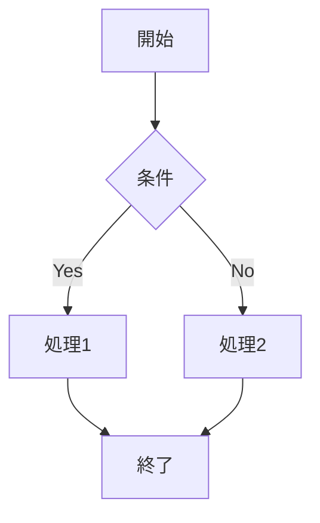

# ドキュメント作成ガイド

## 概要

LLM/探索型ワークフローに最適化されたドキュメントを作成するためのガイドラインです。

## コンテキストエンジニアリングの原則

### 1. 適切なファイルサイズ

- **推奨**: 100-500 行
- **最大**: 1000 行
- 大きすぎるファイルは分割する

### 2. frontmatter の活用

すべてのドキュメントに frontmatter を設定：

```yaml
---
title: "ドキュメントタイトル"
category: knowledge | design | guide
tags: [tag1, tag2, tag3]
related:
  - ./related-doc-1.md
  - ./related-doc-2.md
---
```

### 3. 相互リンク

- 最低 2 つの関連ドキュメントへのリンクを含める
- 関連ドキュメントからもリンクバックする

### 4. 構造化

- 明確な見出し階層
- 箇条書きの活用
- コード例の提供

## Mermaid 図の活用

複雑なフローは Mermaid 図で可視化：



## ディレクトリ別の書き方

### knowledge/

- 「どうやるか」を説明
- ベストプラクティスとアンチパターンを併記
- トラブルシューティングを含める

### design/

- 「なぜそうするか」を説明
- 設計判断の背景を記載
- トレードオフを明記

### guide/

- 手順を明確に
- チェックリストを含める
- 具体例を提供

## チェックリスト

- [ ] frontmatter が設定されている
- [ ] 500 行以内に収まっている
- [ ] 2 つ以上の関連ドキュメントへのリンクがある
- [ ] コード例がある（技術ドキュメントの場合）
- [ ] 見出し階層が適切である
