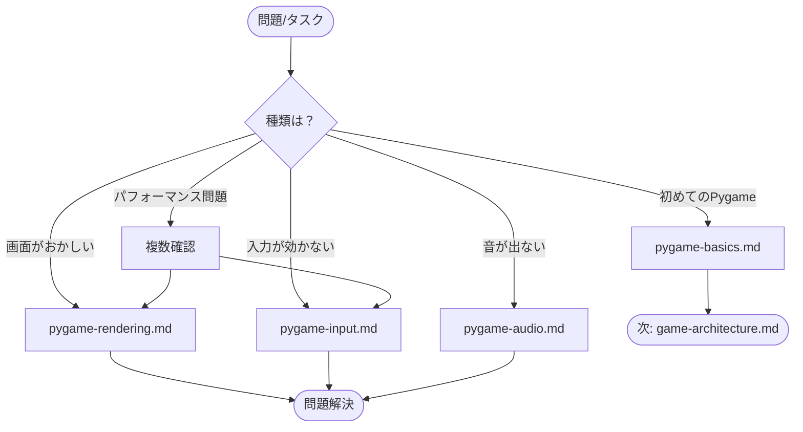

# Knowledge - 実践的知識

このディレクトリには、Pygame ゲーム開発における実践的な知識をまとめています。

---

## ドキュメント一覧

| ドキュメント | 説明 | 優先度 |
|-------------|------|--------|
| [pygame-basics.md](./pygame-basics.md) | Pygame の基礎（初期化、ゲームループ、座標系） | ⭐⭐⭐ 必読 |
| [pygame-rendering.md](./pygame-rendering.md) | 描画処理（基本描画、アニメーション、最適化） | ⭐⭐ 推奨 |
| [pygame-input.md](./pygame-input.md) | 入力処理（マウス、タッチ、キーボード） | ⭐⭐ 推奨 |
| [pygame-audio.md](./pygame-audio.md) | 音声処理（効果音、プロシージャル生成、BGM） | ⭐ 必要時 |

---

## いつ何を読むか

---

## 各ドキュメントの概要

### pygame-basics.md - Pygame 基礎

**内容**:
- Pygame 初期化パターン
- ゲームループ構造
- 座標系とサーフェス
- デルタタイムによるフレームレート独立

**こんな時に読む**:
- 初めて Pygame を使う
- ゲームループの構造を確認したい
- 座標系で混乱している

→ [pygame-basics.md](./pygame-basics.md)

---

### pygame-rendering.md - 描画処理

**内容**:
- 描画の基本原則（fill → draw → flip）
- 基本描画関数（rect, circle, line, polygon）
- 画像の扱い（load, convert_alpha, blit）
- アニメーションパターン
- パフォーマンス最適化

**こんな時に読む**:
- 図形や画像を描画したい
- アニメーションを実装したい
- 描画がちらつく/遅い

→ [pygame-rendering.md](./pygame-rendering.md)

---

### pygame-input.md - 入力処理

**内容**:
- イベントシステム
- マウス入力（クリック、ドラッグ）
- タッチ入力（幼児向け最適化）
- キーボード入力
- 寛容な当たり判定

**こんな時に読む**:
- クリック/タッチ処理を実装したい
- 入力が反応しない
- 幼児向けタッチ最適化をしたい

→ [pygame-input.md](./pygame-input.md)

---

### pygame-audio.md - 音声処理

**内容**:
- ミキサー初期化
- 効果音（Sound）の再生
- プロシージャル音声生成
- BGM（Music）のストリーミング
- 音量管理

**こんな時に読む**:
- 効果音/BGM を追加したい
- 音が出ない
- 外部ファイルなしで音を生成したい

→ [pygame-audio.md](./pygame-audio.md)

---

## トラブルシューティング

各ドキュメントにはトラブルシューティングセクションがありますが、統合版も用意しています：

→ [../troubleshooting.md](../troubleshooting.md)

---

## 関連ドキュメント

- [design/](../design/README.md) - 設計思想（なぜそう実装するか）
- [troubleshooting.md](../troubleshooting.md) - 問題解決ガイド
- [docs/README.md](../README.md) - ドキュメント全体のインデックス
