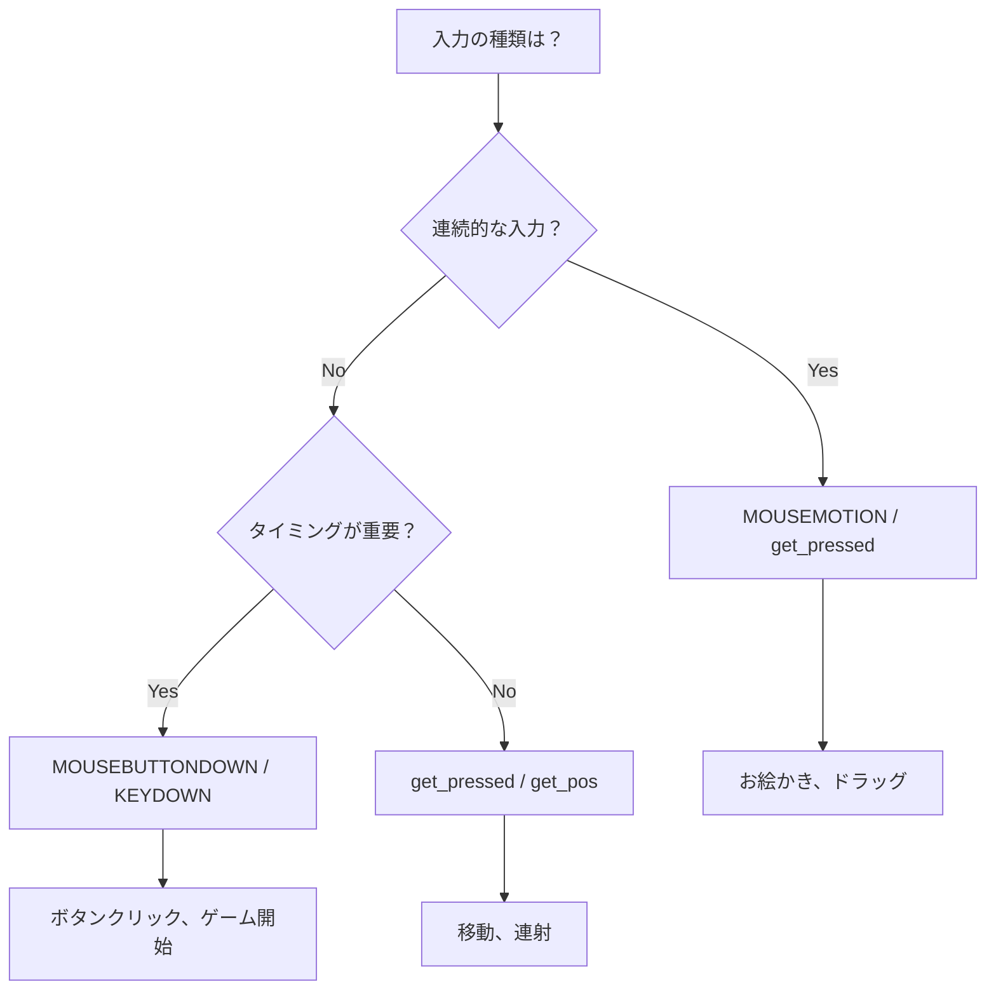

# Pygame 入力処理

## 概要

Pygame での入力処理（マウス、タッチ、キーボード）のパターンを解説します。Baby Fun Box は 1〜2 歳児向けのため、タッチ操作に最適化された設計が重要です。

---

## イベントシステム

### イベントの取得

```python
# イベントキューから全イベントを取得
events = pygame.event.get()

for event in events:
    if event.type == pygame.QUIT:
        # ウィンドウの×ボタン
        pass
    elif event.type == pygame.MOUSEBUTTONDOWN:
        # マウス/タッチのプレス
        pass
    elif event.type == pygame.KEYDOWN:
        # キー押下
        pass
```

### イベントの種類

| イベント | 発生タイミング | 主な属性 |
|---------|--------------|---------|
| `QUIT` | ウィンドウを閉じる | なし |
| `MOUSEBUTTONDOWN` | マウス/タッチ押下 | `pos`, `button` |
| `MOUSEBUTTONUP` | マウス/タッチ離す | `pos`, `button` |
| `MOUSEMOTION` | マウス/タッチ移動 | `pos`, `rel`, `buttons` |
| `KEYDOWN` | キー押下 | `key`, `mod` |
| `KEYUP` | キー離す | `key`, `mod` |

### イベント処理の分離

```python
class Game(BaseGame):
    def handle_events(self, events: list[pygame.event.Event]) -> None:
        for event in events:
            if event.type == pygame.MOUSEBUTTONDOWN:
                self._handle_click(event.pos)
            elif event.type == pygame.KEYDOWN:
                self._handle_key(event.key)

    def _handle_click(self, pos: tuple[int, int]) -> None:
        """クリック処理を別メソッドに分離"""
        for button in self.buttons:
            if button.rect.collidepoint(pos):
                button.on_click()
                return

    def _handle_key(self, key: int) -> None:
        """キー処理を別メソッドに分離"""
        if key == pygame.K_ESCAPE:
            self.request_return_to_launcher()
```

---

## マウス入力

### クリック検出

```python
if event.type == pygame.MOUSEBUTTONDOWN:
    x, y = event.pos
    button = event.button  # 1=左, 2=中, 3=右

    if button == 1:  # 左クリック
        for obj in self.objects:
            if obj.rect.collidepoint(x, y):
                obj.on_click()
```

### ドラッグ検出

```python
class DraggableObject:
    def __init__(self):
        self.dragging = False
        self.rect = pygame.Rect(100, 100, 50, 50)

    def handle_event(self, event: pygame.event.Event) -> None:
        if event.type == pygame.MOUSEBUTTONDOWN:
            if self.rect.collidepoint(event.pos):
                self.dragging = True

        elif event.type == pygame.MOUSEBUTTONUP:
            self.dragging = False

        elif event.type == pygame.MOUSEMOTION:
            if self.dragging:
                self.rect.center = event.pos
```

### 現在のマウス状態

イベントを使わずに現在の状態を取得：

```python
# 現在の位置
x, y = pygame.mouse.get_pos()

# 現在のボタン状態
buttons = pygame.mouse.get_pressed()
if buttons[0]:  # 左ボタンが押されている
    pass
```

---

## タッチ入力

### マウスイベントとの互換性

多くの環境で、タッチ入力は自動的にマウスイベントとして扱われます：

```python
# タッチもマウスクリックとして処理される
if event.type == pygame.MOUSEBUTTONDOWN:
    # マウスクリックもタッチも両方ここで処理
    self._handle_touch(event.pos)
```

### タッチ専用イベント（SDL2）

より詳細なタッチ情報が必要な場合：

```python
if event.type == pygame.FINGERDOWN:
    # マルチタッチ対応
    finger_id = event.finger_id
    # 正規化された座標 (0.0 ~ 1.0)
    x = event.x * self.width
    y = event.y * self.height

elif event.type == pygame.FINGERUP:
    pass

elif event.type == pygame.FINGERMOTION:
    # dx, dy で移動量も取得可能
    pass
```

### タッチ対応のベストプラクティス

```python
def handle_events(self, events: list[pygame.event.Event]) -> None:
    for event in events:
        # マウスとタッチの両方に対応
        if event.type == pygame.MOUSEBUTTONDOWN:
            self._handle_touch(event.pos)

        # タッチ専用イベントも処理（必要な場合）
        elif event.type == pygame.FINGERDOWN:
            x = int(event.x * self.width)
            y = int(event.y * self.height)
            self._handle_touch((x, y))
```

---

## キーボード入力

### 単一キー

```python
if event.type == pygame.KEYDOWN:
    if event.key == pygame.K_ESCAPE:
        self.request_return_to_launcher()
    elif event.key == pygame.K_SPACE:
        self.pause()
```

### 修飾キー

```python
if event.type == pygame.KEYDOWN:
    # Ctrl+S
    if event.key == pygame.K_s and event.mod & pygame.KMOD_CTRL:
        self.save()

    # Shift+クリック
    if event.mod & pygame.KMOD_SHIFT:
        pass
```

### 現在のキー状態

```python
# 押されているキーの配列
keys = pygame.key.get_pressed()

if keys[pygame.K_LEFT]:
    self.player.move_left()
if keys[pygame.K_RIGHT]:
    self.player.move_right()
```

---

## 幼児向け入力設計

### タッチターゲットサイズ

```python
from shared.constants import MIN_TOUCH_SIZE

class Button:
    def __init__(self, x: int, y: int, width: int, height: int):
        # 最小サイズを保証
        width = max(width, MIN_TOUCH_SIZE)   # 80px 以上
        height = max(height, MIN_TOUCH_SIZE)
        self.rect = pygame.Rect(x, y, width, height)
```

### 寛容な当たり判定

```python
class Balloon:
    def __init__(self, x: float, y: float, radius: float):
        self.x = x
        self.y = y
        self.radius = radius
        # 当たり判定を実際より大きく
        self.hit_radius = radius * 1.2

    def is_hit(self, pos: tuple[int, int]) -> bool:
        dx = pos[0] - self.x
        dy = pos[1] - self.y
        distance = math.sqrt(dx * dx + dy * dy)
        return distance <= self.hit_radius
```

### 即座のフィードバック

```python
def _handle_touch(self, pos: tuple[int, int]) -> None:
    for balloon in self.balloons:
        if balloon.is_hit(pos):
            # 即座に視覚フィードバック
            self._create_pop_effect(balloon)
            # 即座に聴覚フィードバック
            self.pop_sound.play()
            # オブジェクト削除
            self.balloons.remove(balloon)
            return
```

### 誤タッチ防止

```python
class Button:
    def __init__(self):
        self.last_click_time = 0
        self.cooldown = 0.3  # 300ms

    def on_click(self) -> bool:
        current_time = time.time()
        if current_time - self.last_click_time < self.cooldown:
            return False  # クールダウン中
        self.last_click_time = current_time
        return True
```

---

## 決定木: 入力タイプの選択



---

## トラブルシューティング

### 問題: クリックが反応しない

**原因1**: 当たり判定が小さすぎる

**解決策**:
```python
# 80px 以上を保証
MIN_TOUCH_SIZE = 80
```

**原因2**: イベントを 2 回取得している

**解決策**:
```python
# 悪い例
for event in pygame.event.get():
    pass
for event in pygame.event.get():  # 空になっている
    pass

# 良い例
events = pygame.event.get()
for event in events:
    pass
```

### 問題: ダブルクリックになる

**原因**: BUTTONDOWN と BUTTONUP の両方で処理している

**解決策**:
```python
# どちらか一方のみで処理
if event.type == pygame.MOUSEBUTTONDOWN:
    self._handle_click(event.pos)
# BUTTONUP では処理しない
```

### 問題: タッチが反応しない

**原因**: タッチイベントがマウスイベントに変換されていない

**解決策**:
```python
# SDL のヒント設定（main.py で）
import os
os.environ['SDL_MOUSE_TOUCH_EVENTS'] = '1'
```

---

## 関連ドキュメント

- [Pygame 基礎](./pygame-basics.md) - イベントループの基本
- [幼児向け UX 設計](../design/toddler-friendly.md) - タッチターゲット設計
- [ゲームアーキテクチャ設計](../design/game-architecture.md) - handle_events の責務
